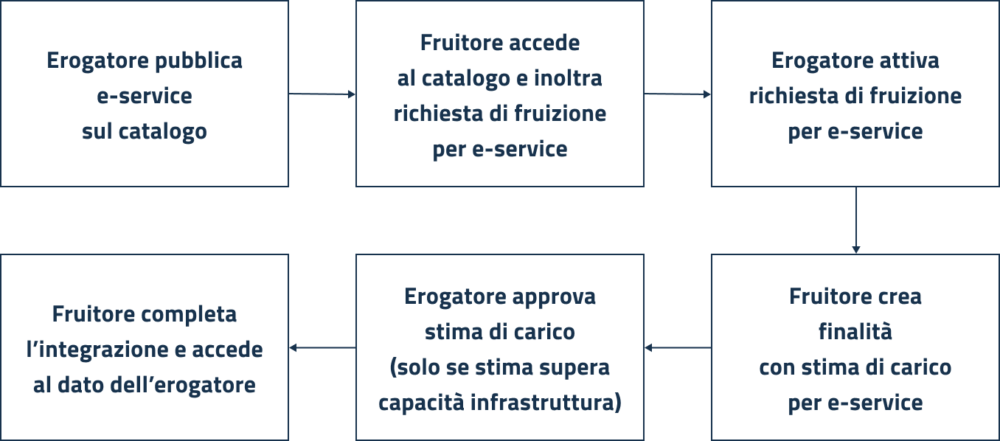

# General working principles

The interoperability ecosystem comprises various components, protocols, and standards. PDND serves as the enabling platform at the core of this ecosystem.

To share their data via PDND, a party must follow these steps:

1. [Subscribe](https://docs.pagopa.it/interoperabilita-1/manuale-operativo/guida-alladesione) to PDND (just the first time).
2. Access the platform to verify the APIs already present in the E-service Catalog.
3. Develop an API that complies with the security perimeter and standards outlined in the _Model of Interoperability_ (ModI) defined by AgID. It outlines the boundaries for interoperability among public administrations. Further references are available in the [dedicated section](../../technical-guide/e-services/references-and-tools.md).
4. Add [a check](../../technical-guide/utilizzare-i-voucher/checks-on-a-bearer-voucher-by-a-producer.md) to the API to validate the legitimacy and validity of vouchers presented by data requesters. A voucher is valid only if it is issued by PDND, is currently valid, and pertains to the correct resource.
5. Publish the API as an e-service on the PDND E-service Catalog, including all necessary contextual and descriptive information.

## Interacting with the platform

The back office supports two modes of use: **producing** (erogazione) and **consuming** (fruizione).

Each party on PDND may act solely as a producer of e-services, solely as a consumer, or fulfill both roles—providing some e-services and consuming others.

PDND provides a graphical back-office interface to manage all aspects of the e-service lifecycle—creation, modification, updating, and archiving—for both providers and consumers. It also offers a set of APIs to automate these processes.

## Basic producer/consumer flow

Below is a **simplified flow** offering a general overview of how the platform works. Several steps are detailed in other sections.

<figure><figcaption>
Un flusso minimo di funzionamento: dall'erogatore che pubblica un e-service sul catalogo a un fruitore che accede alle informazioni attraverso la fruizione del servizio
</figcaption></figure>

## **Producer flow**

An entity wishing to **provide** an e-service can create and manage it through the platform. Once published, the service appears in the **E-service Catalog**, where it is available for consumption.

Interested parties that meet the required attributes may submit a **service request**, which the provider can review and manage.

Only after this service request is approved can the consumer proceed to submit the **purposes** (_finalità_) and begin using the e-service.

## **Consumer flow**

An entity wishing to **consume** an e-service can browse the **E-service Catalog** to see what's available. If it meets the **minimal requirements**, it can submit a **service request**, which the producer evaluates.

Once the request is approved and active, the consumer may create **purposes** including:

* **Details on data access and processing** (GDPR compliant, called risk analysis — _analisi del rischio_).
* An **estimated load**, i.e., the number of daily API calls expected to the producer.

If the estimated load exceeds the producer’s infrastructure capability, **further technical approval** is required before using the purpose to access the e-service.

Once the purpose is active, the consumer completes the technical integration and **obtains a** **voucher** from PDND to access the producer's API. These aspects are covered in greater detail in the relevant sections of the guide.
