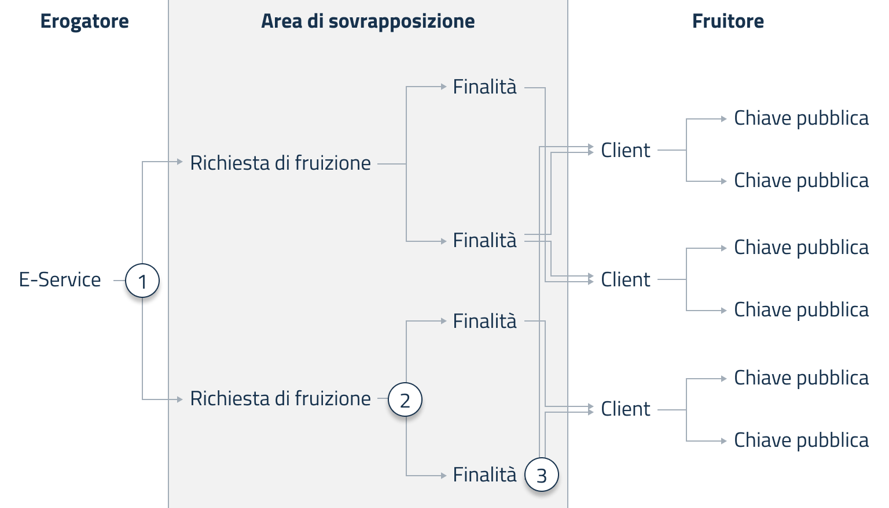

# Restrictions and service suspensions

PDND allows parties to intervene promptly in case of malfunctions or potential misuse by suspending the service at different points in the workflow.

<figure><figcaption>
Un diagramma che dettaglia le aree di sovrapposizione sulle operazioni. Gli e-service sono esclusiva competenza dell'erogatore, client e chiavi pubbliche del fruitore. Richieste di fruizione e finalità sono invece parti sulle quali entrambi gli attori possono agire
</figcaption></figure>

Here are the points where parties can stop the flow of data:

1. In an emergency, the producer can unilaterally **suspend a version of an e-service**, effectively blocking access to all associated service requests and their related purposes. The producer may also suspend an e-service temporarily for maintenance, provided users are given adequate notice.
2. Both the producer and the consumer can unilaterally **suspend a service request**, halting access to all associated purposes. PDND may also unilaterally suspend a consumption request in exceptional cases—for example, if the consumer loses a certified attribute.
3. Both parties (producer and consumer) may **suspend a** **purpose**.

Each suspension action prevents the issuance of any vouchers for that specific e-service, service request, or purpose—even if all other components of the flow are active and properly integrated. The flow is restored once all suspended components are reactivated.
