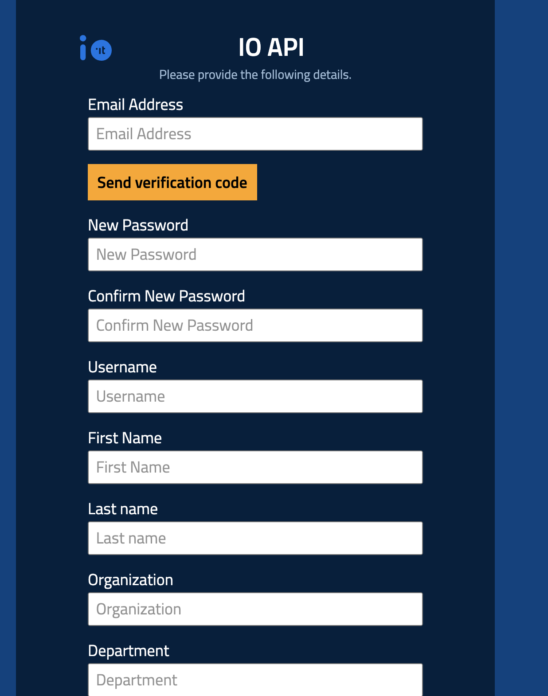

# Developer Portal Registration


The Developer Portal is still operational, but it will be decommissioned in the coming months.


The first step to using the IO APIs is [**registering for the Developer Portal**](https://developer.io.italia.it/)**.**

To complete the registration, you will have to validate an email address, a mobile number, and enter the entity's data.

<figure><figcaption></figcaption></figure>

## Sandbox

After these preliminary steps, you will only be able to test the following IO APIs using the test citizen with the Fiscal Code **`AAAAAA00A00A000A`**:

- [Submit a Message passing the user fiscal\_code in the request body](https://developer.io.italia.it/openapi.html#operation/submitMessageforUserWithFiscalCodeInBody);
- [Submit a Message passing the user fiscal\_code as path parameter](https://developer.io.italia.it/openapi.html#operation/submitMessageforUser);
- [Get Message](https://developer.io.italia.it/openapi.html#operation/getMessage);
- [Get a User Profile using POST](https://developer.io.italia.it/openapi.html#operation/getProfileByPOST);
- [Get a User Profile](https://developer.io.italia.it/openapi.html#operation/getProfile);
