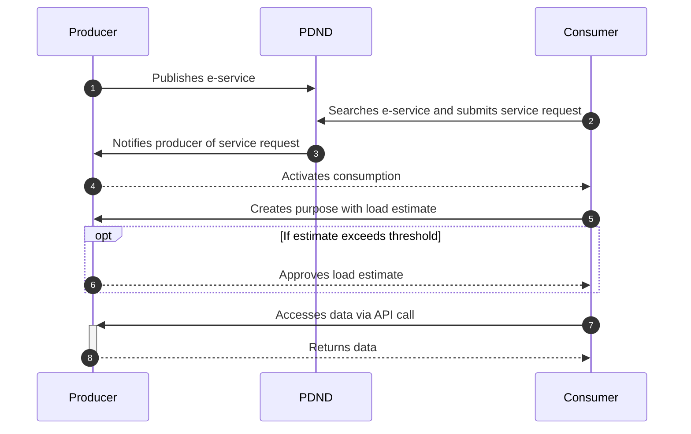

# How it works: the operational flow

## Ecosystem and platform role

Interoperability is an **ecosystem** composed of components, protocols, and standards. **PDND** is the **enabling platform** at the center of this ecosystem, making it possible to publish and consume e-services.

## Steps to share data on PDND

1. **Subscription**\
   **Only once**, [join PDND](funzionamento-generale.md).
2. **Catalog verification**\
   Access the platform and **check the APIs already available** in the **E-service Catalog**.
3. **Develop a ModI-compliant API**\
   Write an **API** that complies with the **security perimeter** and the **standards of the Interoperability Model (ModI)** defined by AgID, which sets the interoperability framework between Public Administrations. More details are provided in the [dedicated section](../technical-references/e-services/tools-and-references.md).
4. **Voucher validation**\
   Add a **control mechanism** to your API to verify the **legitimacy and validity** of **vouchers** presented by data requesters. The voucher is valid only if **issued by PDND**, **currently valid**, and **linked to the correct resource**. More details are provided in the [dedicated section](../tutorials/tutorials-for-producers/checks-on-a-bearer-voucher-by-a-producer.md).
5. **Publication as an e-service**\
   Publish the API on the **PDND Catalog** as an **e-service**, including all **contextual and supporting information** needed for its use cases.

## Platform usage modes

* The platform operates in two modes: **producing** and **consuming**.
* Each party registered on PDND can act **only as a producer**, **only as a consumer**, or **as both** (producing some e-services and consuming others).
* PDND provides a **graphical interface (front office)** to manage all operations related to **creating, modifying, updating, and archiving** the e-service lifecycle, both for producers and consumers. It also offers a **set of APIs** to interact with the platform and **automate processes**.

## Basic producer/consumer flow

Below is a **simplified flow** providing an overview of how the platform works. Some steps are explored in detail in specific sections.

## Producer flow

1. A party wishing to **produce an e-service** can **create and manage it** through the platform, as described in a [previous section](normativa-e-approfondimenti.md#steps-to-share-data-on-pdnd).
2. **Once published**, the service becomes **available in the Catalog**, where it can be viewed in **consuming mode**.
3. Interested parties, **if meeting the producer’s minimum requirements** (**attributes**), can **submit a service request**.
4. The producer can **review and manage** these requests.
5. **After approval**, the consumer can **declare its purposes** and **start consuming** the e-service.

## Consumer flow

1. A party wishing to **consume an e-service** can **browse the Catalog** to view available ones.
2. If it **meets the required minimum requirements**, it can **submit a service request**, which will be **reviewed by the producer**.
3. Once the request is **approved and active**, the consumer can **define purposes**, specifying:
   * **Details on data access and processing** (_risk analysis_).
   * **Load estimate**, i.e., the **expected number of daily API calls** to the producer.
4. If the **load estimate** **exceeds the producer’s infrastructure capacity**, an **additional technical approval** is required before using the purpose to access the e-service.
5. When the **purpose is active**, the consumer can **finalize the technical integration** to **obtain a voucher** from PDND and **access the producer’s API**.
6. All these aspects are explored in detail in their respective sections of the guide.

***

Next page [→ How to join: the complete guide](funzionamento-generale.md)
