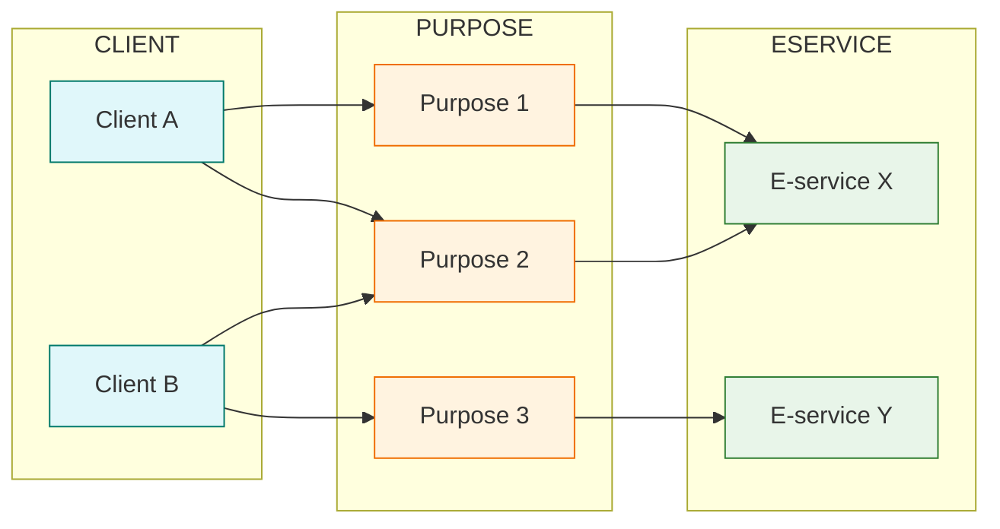

# Client management

### Client–purpose association

The client system is designed to offer **maximum flexibility** to parties, allowing them to structure the management of **application identities** according to their own organizational processes, **without having to adapt** to platform-specific rules.

Each party can choose the approach that best fits its operational and security needs, adopting one of the following models:

* **One client per e-service**, for precise and independent management of each service;
* **Multiple clients per e-service**, to divide responsibilities among different technical teams or suppliers;
* **One client for multiple e-services**, to simplify management in contexts with homogeneous workloads and centralized control.

### Choosing the management model

The choice of model depends on the **balance between security and maintainability**: the organization of clients must ensure that technical users have **visibility only over the purposes** for which they operate, preventing unauthorized access to unrelated purposes.

For an operational overview, see the [**dedicated client webinar**](https://developer.pagopa.it/webinars/e-service-erogazione-inversa) (starting at minute 24:20, free registration required).


Assign **descriptive names** to clients to make them easier to identify — for example, linking them to the workgroup or supplier that uses them (e.g., “Software House X – Payments e-service”).


***

Next page [→ Vouchers](../utilizzare-i-voucher/)
