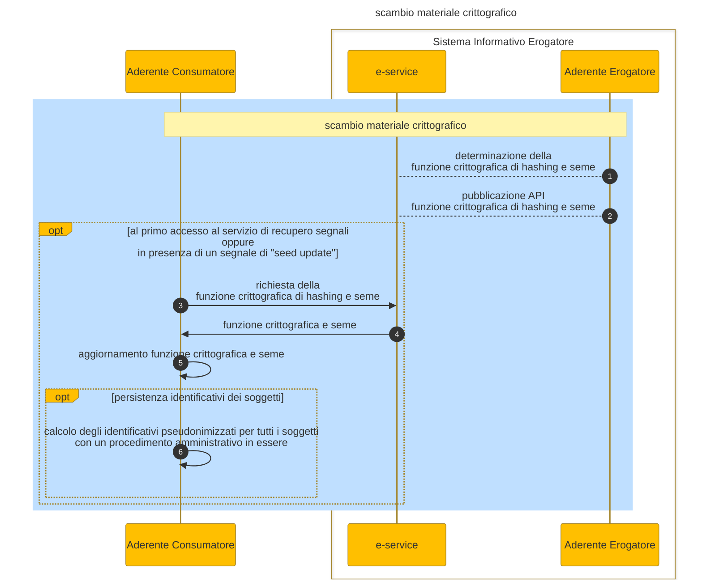

# Exchange or update of cryptographic information

The management of cryptographic information is a necessary condition for signal deposit and recovery. Below

1. the provider makes the cryptographic information available in the API of the published service: hash function and seed
2. Before accessing the signal recovery service or when a _SeedUpdate_ type of signal is received (see the section on [types of signals](../the-technical-guide/signals.md)), the user requests the cryptographic information from the e-service of interest
3. The user possesses the updated cryptographic information and is able to calculate the pseudonymized identifiers for all subjects with a current administrative process that are contained in their database
4. The user can make the pseudonymized identifiers associated with subjects persistent based on how to decide to implement the search for the pseudonymized identifiers contained in the signals (see signal processing)

