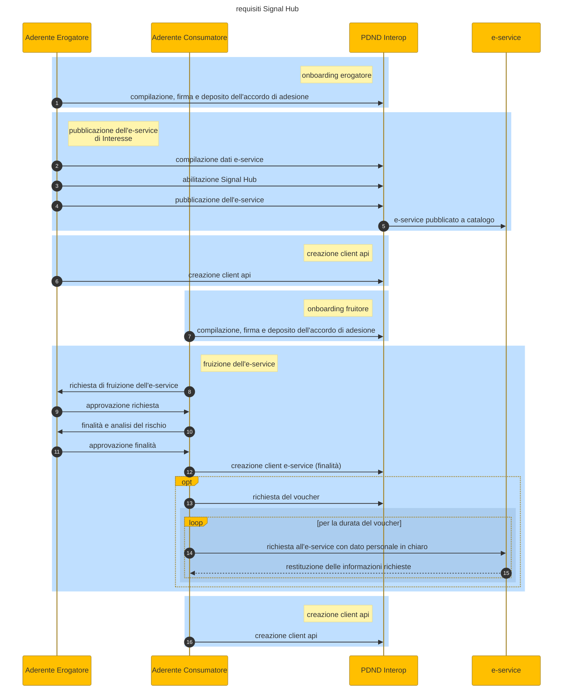

# Prerequisites

To be able to access the service, the following preliminary operations must be performed, in PDND Interoperability:

* the member subjects, both those that provide and those who use data, must have completed the [**onboarding on PDND**](https://mermaid.live/edit#pako:eNqNkk2L2zAQhv-KUA9twVnifG0iSmCbbKCHlrCBHoousjX2CuQZdyxDsyH_vbKyaSiltD7IGumZdyS9c5IlWZBKjkYjjcEFD0oQFmTYOqw1loSVq5VGIcIzNHG3MB38Cr8adqbw0CVCiJZdY_i4IU-shJZvdruPu_FYS42pgsYOvveAJWydqdk0Gk0fCPumAH6VMBxc6VqDQeyfhOnEgwUGDCAemWoTiOFPcnP4jdwQdn3zF3a__bId6PT_FHGmdjhaxBjKILgu3uWrPBOTyTQO8_n7i8bwIUV1D1UQVCUBlZZvTyYs1N6JhxBru1ve_mm0Xl_4kprWefPiCCETlePGCIhpLXUuUJx4_9aUJbGNgRPGQjegN63N4X-1PhS8_ocgoNUoM9lAzHU2tsJp2NAy-avl4KKFyvQ-DC6eIzo4djhiKVXgHjLZt9aEq6FSVcZ3cTU-tVQn-UOq2fJusZjm43wxnk3ul3kmj1Llq_u7Sb6azPPpdLFcLWfnTL4Qxfz8qvho4x34WgVS9PnSrqlrU41vKeeCMPX18-sBzj8BoLXuZQ) by means of the standard contract and who are members in all respects
* the member must have [**published the e-service**](https://mermaid.live/edit#pako:eNp9kkGPmzAQhf_KyD20lWAV2MAGq4rUNonaQ6vVRuph5csAE2LJ2NSYqtko_70GQhq10XLAMv7ezDNvjqwwJTHOwjAU2kmniEPT5bmSBb5IowkobMn-kgUJXRi9kxUXGsDtqfZoji1dtj_QSswVtQMB0FhZoz18NspYDoK92Ww-bWYzwYQe2gnd0s-OdEEriZXFWmjsnNFdnZM9l0DrZCEb1A4enwBb-FiSJe0I1tZU6IylG-Tq-6pnh_Wrh61p_qfW2565ut6IWCoc2Cp_F2VRAHF8719J8n481MZ3trLaOzA77-jfn1WSUm8vJeFDbpdQytEDte3Za_88PoXLZW-QQ2HqRqqpAjp5beoGj7lU0p35raw0KvjS5TfZ1-xdCTzrJest_9v6InUGEPyCylRm1JAuhWYBq8nWKEs_P8f-QLBhDgTr0y5ph51yfdonj_bJbg-6YNzZjgLWNf6mU_DTR58L40f2m_FkcZem91GSzuOHRRZlATswns7v4iiLH7IkWWSzdJ6dAvZijJdHU8F1Kf1MTPVo2H0bR3yY9KHH86AZEWu6as_4DlVLpz89u_5Y) of interest and have it **enabled for Signal Hub**
* the user member [**accesses the e-service of interest**](https://mermaid.live/edit#pako:eNqFlNuO2jAQhl9l5F50kQAlARqSi5VaDlIvWlUg9aLKjUkmYCnY6cRBZdG-S9-lL9ZxOIUFaX2Rw_j_v3HGnhxEajIUsej1eom2yhYYQ071izIaAXsV0k6lmOjU6Fyt40QD2A1uWbWSFV5ef0pSclVg1SgASlJbSfuJKQzFkIgP8_mXueclItFNpkRX-LtGneJUyTXJbaJlbY2utyukE0KSVakqpbYwWYKs4HOGhNoizKlW1hCCA73V_ph-nzp1c__KcjLlvWq2uCHOyKylQz5QNrlbpTgnJUwt0Hr15Ed-F4JgwJfRqHOc1IappNYbCybn9TdVVceyZlgUH1tAOI3Jsvf8PFvE7Es3CisrIVMtn3xsmy3Y5jLIsiSzk0fxhfGAnystC2X__e0DU91zpdyq2FSxy7zHvvjfsF3JY0gJT7q0UFzda-3g6eLsXK1umNLeBlq8VjV4iTtTp5vzGWmP63aEbju8EV8GUedeWBhTQokEBRNrku-Br6VbthdzsxvA_QEZnyAHrgx_JILSwFpJ5jFytuydakvMU7a-Hg7nzQ1tmzKqS068B6HOAG7DHLoLnCTNlOiKLTJbZdz2BzeRiKaHE-E6NcNc1oV1nfrKUteVy71ORWypxq6oS_7Kc9Oeg9wnIj6IPyKOgr4XecPR-FMQBX7o-V2xF_Ew6ofewAvDgT_wo2gQvXbFizHs9_rjcTT0gyAYsiEcjfxzilnmWvycAZu3b8d_VfPLarL-aiBHCZl6vRFxLosKX_8D2-p9ig), after performing the following actions:
  * presentation of the usage request (and concurrent approval by the provider)
  * usage request with ACTIVE status.
  * presentation of at least one purpose, connected to the risk analysis (and concurrent approval by the provider)
  * the status of the same purpose must be ACTIVE.
  * creation of a client connected to the purpose
* the user subjects have created an interop API client necessary for using the signal deposit and recovery service by means of vouchers.

