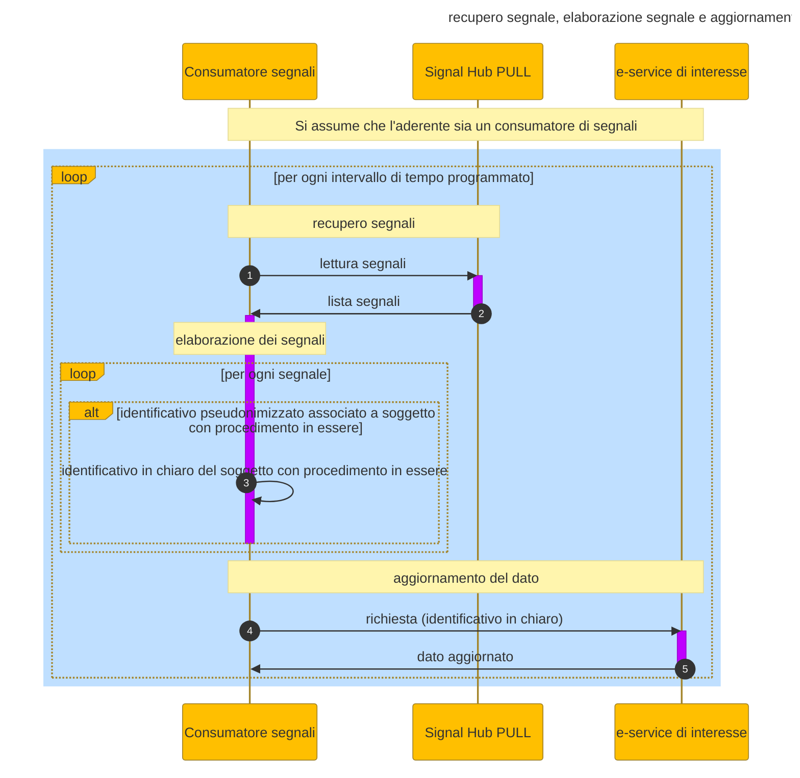

# Signal consumption

The consumer must perform operations for the (1) recovery of signals, (2) processing of signals to (3) obtain the update of the&#x20;

```mermaid
---
title: recupero segnale, elaborazione segnale e aggiornamento del dato
config:
  theme: base
  themeVariables:
    primaryColor: "#FFBF00"
---

sequenceDiagram
autonumber
    participant CS as Consumatore segnali
    participant PULL as Signal Hub PULL
    participant ES as e-service di interesse
    Note over CS, ES: Si assume che l'aderente sia un consumatore di segnali
    rect rgb(191, 223, 255)
        loop per ogni intervallo di tempo programmato
        Note over CS,PULL: recupero segnali
        CS->>PULL: lettura segnali
        activate PULL
        PULL->>CS: lista segnali
        deactivate PULL
        activate CS
        Note over CS: elaborazione dei segnali
        loop per ogni segnale
        alt identificativo pseudonimizzato associato a soggetto con procedimento in essere
        CS->>CS: identificativo in chiaro del soggetto con procedimento in essere
        end
        deactivate CS
        end
        Note over CS,ES: aggiornamento del dato
        CS->>ES: richiesta (identificativo in chiaro)
        activate ES
        ES->>CS: dato aggiornato
        deactivate ES
        end
    end

```

