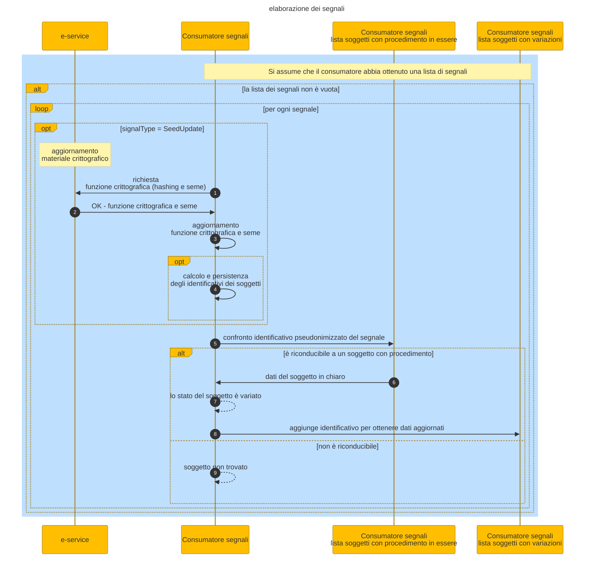

# Signal processing

1. the consumer accesses the list of variation signals
2. If the signals include a _SeedUpdate_ type of signal (see the section on [types of signals](../the-technical-guide/signals.md)), the consumer must update the cryptographic information
3. The consumer searches in the received signals for the associated pseudonymized identifiers related to subjects for which there are current procedures. The search determines if the pseudonymized identifier is attributable to a subject with a current procedure by comparing
   1. the pseudonymized identifier contained in the message
   2. the pseudonymized identifier precalculated or calculated at runtime of each subject for which there is a current procedure
4. the consumer finds a pseudonymized identifier associated with one of the precalculated pseudonymized identifiers and identifies the identifier in clear text of the data subject to variation
5. after examining all the signals, the consumer has the list of identifiers in clear text of data subject to change, necessary for invoking the e-service of interest

