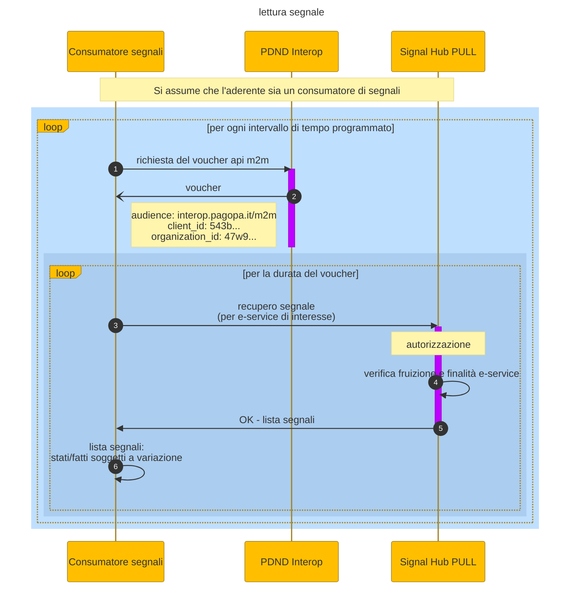

# Signal recovery

1. for each scheduled time interval (see section on [periodic recovery of signals](../the-technical-guide/signals.md#retention-period-policy-e-recupero-periodico-dei-segnali)) the consumer requests the variation signals for the e-service of interest using the Signal Hub signal recovery service
2. the consumer requests and obtains the api voucher from PDND
3. the consumer sends the signal recovery request for the e-service of interest
4. the signal recovery service (_Signal Hub PULL_) authorizes the request and sends the list of signals
5. the consumer has the list of variation signals

