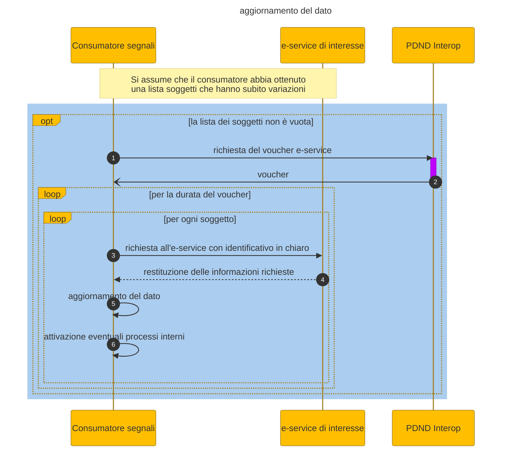

# Data update

1. The consumer has the list of identifiers in clear text of data subject to change
2. The consumer invokes the e-service of interest requesting the updated data by means of the identifier in clear text
3. The consumer has the updated data and can activate additional internal processes triggered by updating the data

