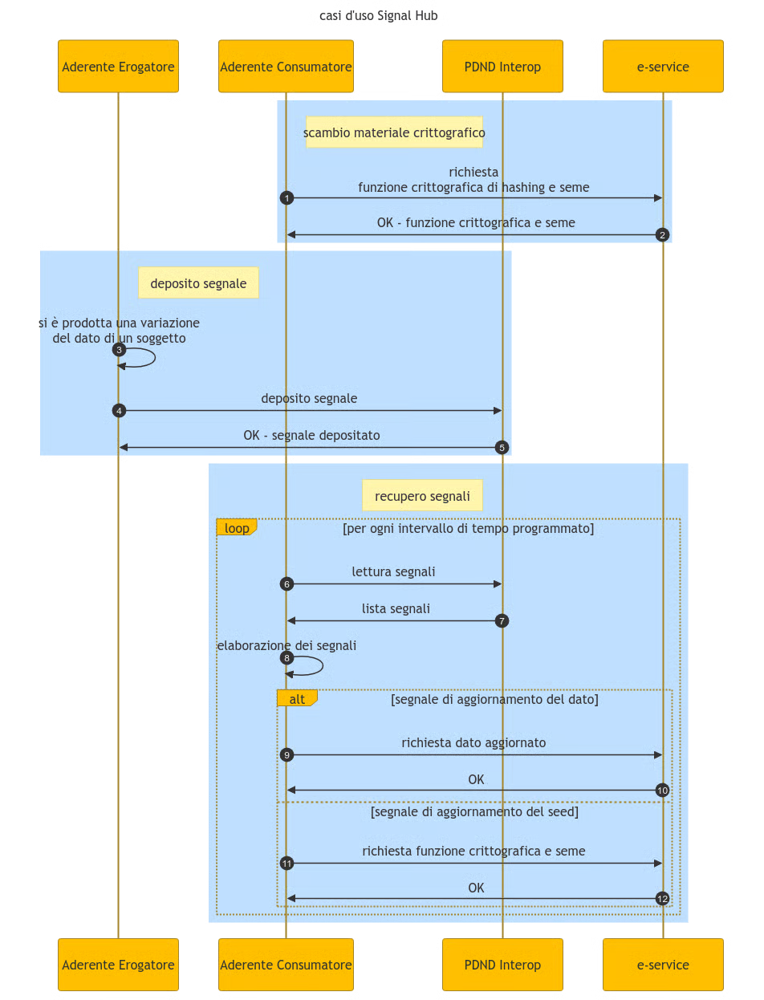

# General function

Use of the Signal Hub

1. [Exchange and update of cryptographic information, prior to the production and recovery of the signals](../how-to/exchange-or-update-of-cryptographic-information.md)
2. [Signal production](../how-to/production-of-signals.md)
3. [Signal consumption](../how-to/signal-consumption.md)
   1. [Signal recovery](../how-to/signal-recovery.md)
   2. [Signal processing](https://app.gitbook.com/o/KXYtsf32WSKm6ga638R3/s/zwqHiUqrZCs3zNnHdc9A/)
   3. [Data update](https://app.gitbook.com/o/KXYtsf32WSKm6ga638R3/s/zwqHiUqrZCs3zNnHdc9A/)
   4. Update of the cryptographic information

<figure><figcaption></figcaption></figure>
