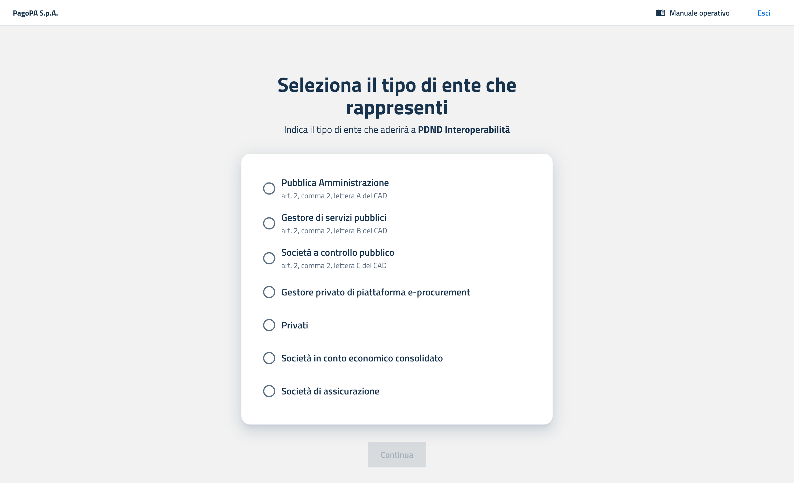

---
metaLinks:
  alternates:
    - >-
      https://app.gitbook.com/s/BPKHO8znE6DiADKFUJfZ/getting-started/funzionamento-generale
---

# How to join: the complete guide

## Prerequisites

* To complete the process, you must have a Level 2 SPID or CIE digital identity.
* The Legal Representative of the party must have a qualified electronic signature (QES) of the CAdES type.

## Preliminary checks

### Public Administration (PA) or Public Service Manager (GSP)

* Verify on [IPA](https://www.indicepa.gov.it/ipa-portale/consultazione/indirizzo-sede/ricerca-ente) that your party’s data are correct and up to date (name, codes, offices, contacts).
* Ensure access to the PEC (certified email) listed as the digital domicile of the party in the IPA Catalog.

### Publicly Controlled Company (SCP)

* Prepare all corporate information that may be requested during the subscription process (e.g., legal and administrative references, tax and registry data).
* Ensure access to the PEC that will be specified in the subscription form.

### Certified private e-procurement platform manager

Complete the [certification process](https://www.agid.gov.it/it/piattaforme/procurement/certificazione-componenti-piattaforme) for the components of the platform published by AgID.\
In summary: the certification attests to the technical and security compliance of the components for interoperability with public platforms. More details are available in the [AgID news release](https://www.agid.gov.it/it/agenzia/stampa-e-comunicazione/notizie/2023/09/25/procurement-pubblicato-schema-operativo-supporto-del-processo-certificazione).

### Company and/or insurance group

Verify your registration in the relevant [register](https://infostat-ivass.bancaditalia.it/RIGAInquiry-public/ng/#/home) and ensure that your data are aligned.\
In summary: registration in the register is a requirement for operating within the reference scope; the IVASS market letter provides application guidance. More details are available in the [IVASS market letter](https://www.ivass.it/normativa/nazionale/secondaria-ivass/lettere/2023/lm-22-11/index.html?dotcache=refresh).

### Other companies

Verify your registration in the relevant register, [Registro Imprese](https://www.registroimprese.it/).

## Guided procedure

### 1. Access to the Members Area



The subscription process begins with SPID or CIE access. The process can be initiated by a user other than the Legal Representative; its legitimacy is ensured because the Membership Agreement to be signed is sent to the institutional digital domicile.

For parties listed in the IPA Catalog, the digital domicile is preconfigured; any updates must be made directly in IPA.

### 2. Selection of the organization type

Select the type of party you are operating for, in accordance with Articles 2, paragraph 2, and 64-bis, paragraph 6, of the Digital Administration Code (CAD).

When the information is available via IPA, the type is preselected, but it can still be modified by choosing a different option.

<figure><figcaption>
Screen for selecting the organization type
</figcaption></figure>

Next, confirm that the displayed information is correct to proceed.

### 3. Selection of the party to subscribe for

Only for Public Administrations (PA), Public Service Managers (GSP), Publicly Controlled Companies (SCP), and Companies within the Consolidated Economic Account (SCEC).

<figure><figcaption>
Screen for selecting the party for SCPs
</figcaption></figure>

<figure><figcaption>
Screen for selecting the party for PAs and GSPs
</figcaption></figure>

#### Public Administrations (PA) and Public Service Managers (GSP)

* Select the party using the “Search entity” autocomplete field.
* The list is fed by the IPA Catalog.
* If the party is not listed, use the informational link below the field to learn how to register on IPA.

#### Publicly Controlled Companies (SCP) and Companies within the Consolidated Economic Account (SCEC)

* Enter the tax code of the company.
* The company name will be automatically displayed after clicking “Continue.”

### 4. Enter party data

<figure><figcaption>
The screen where the party’s data must be entered, usually prefilled with information retrieved from the IPA Catalog.
</figcaption></figure>

* The fields above are prefilled when available, based on official sources.
* When the source is the IPA Catalog, the fields Legal name, Registered office, PEC address, Tax code, and VAT number are locked to ensure consistency with IPA data.
* If the VAT number does not match the Tax code, you may enter a new VAT number by selecting the appropriate option.
* The Recipient code field is always editable.

### 5. Enter the Legal Representative

<figure><figcaption>
The screen where the Legal Representative’s information of the party is entered
</figcaption></figure>

* Fill in the required details in the Legal Representative section.
* For subscription purposes, this person may be either the current representative or an attorney-in-fact with the necessary signing authority.
* The entered data must match those of the person who will digitally sign the _Membership Agreement_.

### 6. Appointment of administrators

<figure><figcaption>
The screen where the data of users with administrative privileges are entered.
</figcaption></figure>

The next step is to appoint one or more Administrators. These users will be the main operators of the PDND front office and will manage the platform on behalf of the party.

For each Administrator to be appointed, the Legal Representative must enter the name, surname, tax code, and professional email address of the individual.

It is advisable to appoint at least two Administrators to ensure operational continuity.

More details on user management are provided in the dedicated section.

### 7. Download and sign the Membership Agreement

At this stage, the platform generates the Membership Agreement, a prefilled document containing the party’s data and the list of designated Administrators.

The party must:

1. Download the Membership Agreement file in `.pdf` format.
2. Have the Legal Representative digitally sign the document using a qualified electronic signature (QES), in CAdES mode. The signed file will have a `.p7m` extension.

### 8. Upload the agreement and finalize

<figure><figcaption>
The screen where the membership agreement received at the digital domicile and signed by the party’s Legal Representative is uploaded.
</figcaption></figure>

The final step is to return to the platform and upload the signed `.p7m` file. The system will automatically verify the signature’s validity.

Once the upload is successfully completed, the subscription process is finalized.


For security reasons, the links in the confirmation email are valid for 30 days from receipt of the PEC containing the Membership Agreement.


## What happens after subscription

Once the procedure is finalized, the appointed Administrators will receive a confirmation email inviting them to perform their first login to the platform. From that moment, they can begin configuring the operational environment, as described in the next chapter.

***

Next page [→ First access and initial configuration](guida-alladesione.md)
