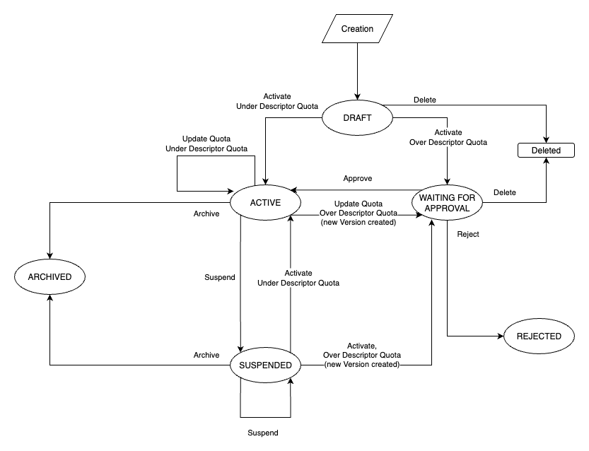

---
metaLinks:
  alternates:
    - >-
      https://app.gitbook.com/s/BPKHO8znE6DiADKFUJfZ/technical-references/api-esposte-da-pdnd-interoperabilita/purpose
---

# Purpose

This section illustrates the concepts and operations related to the **purpose** within the **PDND APIs**. For the functional context and lifecycle of purposes on the platform, refer to the [dedicated section](../finalita/).

### Purpose versions and load estimate management

A **Purpose** may include multiple **versions**:

* `currentVersion`: if present, it is **ACTIVE** or **SUSPENDED**;
* `waitingForApprovalVersion`: if present, it is **WAITING\_FOR\_APPROVAL**;
* `rejectedVersion`: if present, it is the last **REJECTED** version.

Other possible versions:

* **ARCHIVED**: contains a **previous load estimate**;
* **REJECTED**: version whose load estimate was **rejected** by the producer.

Each **modification of the load estimate** always creates a **new version** of the Purpose.\
If the estimate is **below the thresholds** defined in the **e-service version (EServiceDescriptor)**, **or** if it is **approved** by the producer, the **previous version** of the Purpose is **archived**.

### States and transitions — Overview

<table data-header-hidden><thead><tr><th width="134.4312744140625">State</th><th>Description</th><th>Outgoing transitions</th></tr></thead><tbody><tr><td><strong>DRAFT</strong></td><td>Initial state of the <strong>first version</strong> of a newly created Purpose.</td><td>→ <strong>ACTIVE</strong> (estimate ≤ thresholds in the EServiceDescriptor); → <strong>WAITING_FOR_APPROVAL</strong> (estimate > thresholds in the EServiceDescriptor); → <em>deletion</em>.</td></tr><tr><td><strong>WAITING_FOR_APPROVAL</strong></td><td>Load estimate <strong>above thresholds</strong> and <strong>waiting for approval</strong> by the producer. The <strong>currentVersion</strong> (if <strong>ACTIVE</strong>) remains available for <strong>voucher generation</strong>; once approved, the <strong>new version</strong> becomes active and <strong>archives the previous one</strong>. <strong>Deletion</strong> and <strong>rejection</strong> do <strong>not</strong> affect the current version.</td><td>→ <strong>ACTIVE</strong> (estimate approved by the producer); → <strong>REJECTED</strong> (estimate rejected; previous version unchanged); → <em>deletion</em>.</td></tr><tr><td><strong>ACTIVE</strong></td><td><strong>Operational</strong> Purpose; the <strong>only state</strong> that allows <strong>voucher generation</strong>.</td><td>→ <strong>ACTIVE</strong> (load estimate update ≤ thresholds: a <strong>new version</strong> is created, the previous one <strong>archived</strong>); → <strong>WAITING_FOR_APPROVAL</strong> (load estimate update > thresholds: a <strong>new version</strong> is created, the previous one remains <strong>unchanged</strong>); → <strong>SUSPENDED</strong> (manual suspension); → <strong>ARCHIVED</strong> (manual or automatic archiving after activating a new estimate).</td></tr><tr><td><strong>SUSPENDED</strong></td><td><strong>Temporary suspension</strong> (manual by the consumer or producer). <strong>Reversible</strong> state.</td><td>→ <strong>ACTIVE</strong> (if <strong>not suspended by the producer</strong> and <strong>reactivated by the consumer</strong> with estimate ≤ thresholds; or if <strong>reactivated by the producer</strong>, regardless of the estimate); → <strong>WAITING_FOR_APPROVAL</strong> (if <strong>not suspended by the producer</strong> and <strong>reactivated by the consumer</strong> with estimate > thresholds: a <strong>new version</strong> is created, the previous one remains <strong>unchanged</strong>); → <strong>SUSPENDED</strong> (suspension persists or reactivation asymmetric); → <strong>ARCHIVED</strong> (manual or automatic archiving after activation of a new estimate).</td></tr><tr><td><strong>ARCHIVED</strong></td><td><strong>No longer in use</strong>; <strong>non-reversible</strong> state. If no <strong>currentVersion</strong> exists, the Purpose is <strong>permanently archived</strong>.</td><td>— (no transitions).</td></tr><tr><td><strong>REJECTED</strong></td><td>Load estimate <strong>rejected</strong> by the producer; <strong>non-reversible</strong> state. The consumer may <strong>submit a new load estimate</strong>.</td><td>— (no transitions).</td></tr></tbody></table>

### State details

<figure><figcaption>
Flow diagram describing the state transitions.
</figcaption></figure>

#### DRAFT

**Characteristics**

* Initial state of the **first version** of the Purpose.

**Transitions**

* **ACTIVE**: load estimate **below or equal to thresholds**.
* **WAITING\_FOR\_APPROVAL**: load estimate **above thresholds**.
* _Deletion._

#### WAITING\_FOR\_APPROVAL

**Characteristics**

* Estimate **exceeds thresholds** and is **waiting for producer approval**.
* If the **current version** is **ACTIVE**, the Purpose remains **usable** for **voucher generation**.
* Once the new version is **approved**, the previous one is **archived**.
* **Deletion** and **rejection** do **not** affect the current version.

**Transitions**

* **ACTIVE**: estimate **approved** by the producer.
* **REJECTED**: estimate **rejected** by the producer (previous version unchanged).
* _Deletion._

#### ACTIVE

**Characteristics**

* **Operational** Purpose.
* The **only state** that allows **voucher generation**.

**Transitions**

* **ACTIVE**: load estimate update **≤ thresholds** (creates a **new version**, archives the previous one).
* **WAITING\_FOR\_APPROVAL**: load estimate update **> thresholds** (creates a **new version**, keeps the previous one **unchanged**).
* **SUSPENDED**: manual suspension.
* **ARCHIVED**: manual or automatic archiving after activating a new estimate.

#### SUSPENDED

**Access conditions**

* **Manual suspension** by the **consumer** or **producer**.

**Characteristics**

* **Temporarily inactive** Purpose.
* **Reversible** state.

**Transitions**

* **ACTIVE**:
  * if **not suspended by the producer** and **reactivated by the consumer** with **estimate ≤ thresholds**, or
  * if **reactivated by the producer**, regardless of the estimate.
* **WAITING\_FOR\_APPROVAL**: **not suspended by the producer**, **reactivated by the consumer** with **estimate > thresholds** (creates a **new version**, previous one **unchanged**).
* **SUSPENDED**: suspension persists or reactivation asymmetric.
* **ARCHIVED**: manual or automatic archiving after activating a new estimate.

#### ARCHIVED

**Characteristics**

* **No longer in use**.
* **Non-reversible** state.
* If no **currentVersion** exists, the Purpose is **permanently archived**.

**Transitions**

* None.

#### REJECTED

**Characteristics**

* The **load estimate** of the version was **rejected** by the producer.
* **Non-reversible** state.
* The consumer may **submit a new estimate modification**.

**Transitions**

* None.

***

Next page [→ E-services](../e-services/)
