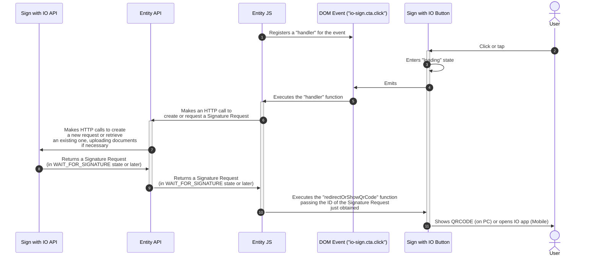

# 🔌 Installation and use

The Sign with IO Button is written in JavaScript and is distributed as a [Web Component](https://developer.mozilla.org/en-US/docs/Web/API/Web_components), so that it can be integrated into web pages and JavaScript web-apps regardless of the JavaScript technologies and frameworks adopted.

Once imported, the component is available on the page as an HTML `custom element`, with the name `io-sign`.

### Including the Sign with IO Button

To use the `io-sign` component, you must include it in your HTML pages (inside `<head>` or at the end of `<body>`)

```html
<script type="module" src="https://assets.cdn.io.pagopa.it/sign/io-sign.js"></script>
```

Finally, to display the Sign with IO Button on the page, simply declare the newly imported HTML element within your HTML template or JS component, just like any other HTML element (`form`, `div`, `video`, ...)

```html
<io-sign></io-sign>
```

### How the component works

When the user clicks or taps the Sign with IO Button, it emits an [Event](https://developer.mozilla.org/en-US/docs/Web/API/Event) called `io-sign.cta.click` in the DOM where it has been inserted. Once the event is emitted, the component enters the `loading` state, which signals to the user that the process of creating (or retrieving) a Signature Request has begun.

The `loading` state ends when the element's `redirectOrShowQrCode(signatureRequestId)` method is called, to which you must pass the ID of the `Signature Request` to be forwarded to the user as the sole input parameter.

The element supports the `disabled` HTML attribute (which works in a very similar way to the homonymous attribute found in HTML elements such as `input` and `button`), which makes the Sign with IO Button unclickable and styles it to appear deactivated.

Finally, the component exposes the `reset()` function, which cancels the `loading` state and resets the component (useful for handling error cases).

#### Example

This example shows how to add the `<io-sign>` element to the page, handle the `io-sign.cta.click` event emitted on click of the Sign with IO Button, and call the `redirectOrShowQrCode` function to show the QR Code or take the user directly to the IO App, or `reset` to terminate the loading.

In your application, inside the `createOrRetrieveSignatureRequest` function (so named here), you will need to put all the business logic necessary to create the Signature Request, get an already created one, and upload the documents by interacting with your back-end APIs integrated with the Sign with IO REST APIs.



In summary, to engage the user via the Sign with IO Button on your web page, you must:

1. Include the `io-sign` HTML element on the page
2. Register an `event listener` for the `io-sign.cta.click` event emitted by the `io-sign` component
3. Insert your business logic inside the handler for the newly registered event
4. Call the `redirectOrShowQrCode` function to display the QR code or redirect the user to the IO app


For **security** reasons, the signature request creation flow, including the uploading of PDF documents, should be carried out _exclusively_ in a server-to-server context (website API to Sign with IO API)



The code example shown uses native JavaScript features, but the component can also be integrated into complex web applications that use libraries/frameworks such as React, jQuery, Vue, Svelte, or Angular.


### Sequence diagram


