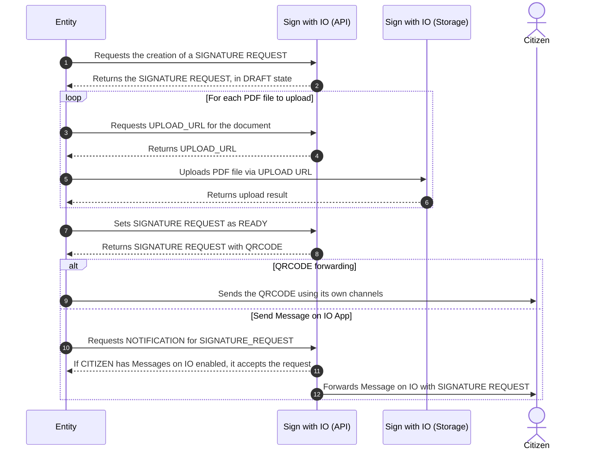

# ✍️ Requesting a signature

Once the documents are prepared in one of the supported formats and the signature fields are inserted, follow these steps to request the user's signature:

<mark style="color:blue;">Step 1</mark>: Create a Dossier

[To find out how, go here](../Creating-the-dossier.md)

<mark style="color:blue;">Step 2</mark>: Retrieve the citizen's ID

[To find out how, go here](Retrieving-the-citizen's-ID.md)

<mark style="color:blue;">Step 3</mark>: Create a <strong>Signature Request</strong>

[To find out how, go here](Creating-a-signature-request.md)

<mark style="color:blue;">Step 4</mark>: Upload the documents

[To find out how, go here](Uploading-documents.md)

<mark style="color:blue;">Step 5</mark>: Send the signature request

[To find out how, go here](invio-della-richiesta-di-firma/)

Here is a sequence diagram outlining the process of creating a "Signature Request", once the "Signer ID" and "Dossier ID" have been obtained

