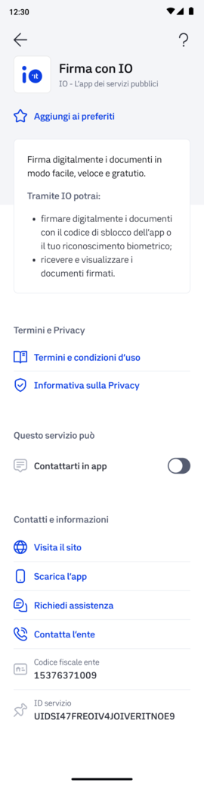
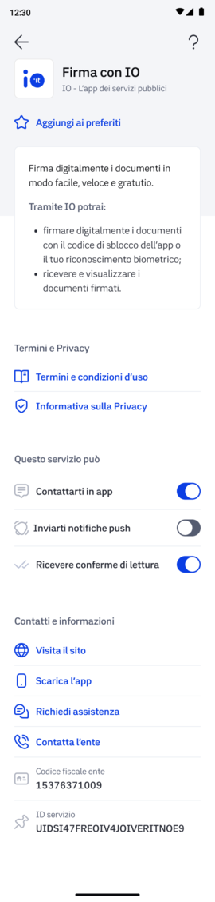

# 📳 Via message on IO

If you want to send the signature request **via message on IO**, you must perform the following steps:

1. wait a few seconds for the signature request to go from the `READY` status to the `WAIT_FOR_SIGNATURE` status
2. make a request to the `PUT /api/v1/sign/signature-requests/{signature_request_id}/notification` endpoint without specifying anything in the message body.

If the user has **enabled receiving messages** from the **Sign with IO** service, you will receive the following message in the output containing the ID of the message sent to the user:

```json
{
  "io_message_id": "01G7VBM888NDGCMA84ZVZYJGZQ"
}
```

### What happens if the user has chosen not to receive communications from Sign with IO?

If you try to send a signature message to a user who has chosen **not to receive communications** from Sign with IO (i.e., if in the Sign with IO service tab they do not have the **“Contact you in the app” flag enabled**):



You will receive an **error message** that will not allow you to proceed with sending the message _(i.e., the \"**io\_message\_id**\" parameter will not be returned)._

In this case, we advise you to:

- Suggest that the user **enables communication** from the Sign with IO service **from the service tab** in the "Services" section of the app;
- Send the signature request via alternative channels—see [tramite-pulsante-firma-con-io-o-qr-code.md](tramite-pulsante-firma-con-io-o-qr-code.md "mention")

If, however, the user **only disables push notifications** in the Sign with IO service tab:



The recipient receives and can view the message in the app, but without receiving the push notification; for this reason, you will receive the io\_message\_id and not an error.


