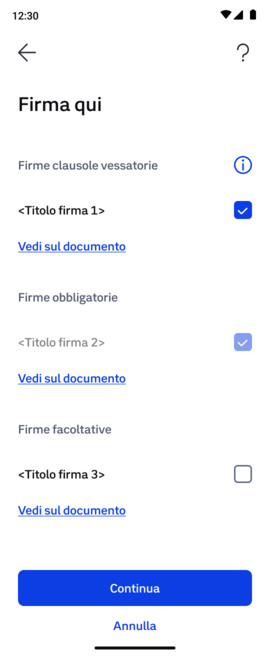

# Identify signature fields

For each document, you will need to identify the **signature fields** — that is, the points where the citizen will place their signature. For each signature field, you will need to indicate:

- A **title**, which will be shown to the user in the app before proceeding with the signature;
- The type of associated clause: **mandatory, unfair, or optional.**


For the **title**, we suggest not exceeding **70 characters**, including spaces.\
Use **capital letters** only at the beginning of a sentence, in acronyms, in proper names, or in the names of institutions

(e.g.: Signature for contract acceptance)



You will need to enter this information within the Dossier you create when requesting the signature: you can find all the instructions in [Creating a Dossier](../../../Creating-the-dossier.md).


<figure><figcaption></figcaption></figure>

### How to identify signature fields

Currently, you can identify signature fields within documents:


[via-coordinates.md](Using-coordinates.md)



**Can I insert signature fields using software like Adobe Acrobat Pro?**

Due to a Google bug, if you insert signature fields using software, the graphic signatures will not be "rendered" correctly when opening the _.pdf_ from Chrome\
(on an Android device or Chrome browser on a desktop). We therefore recommend that you insert the signature fields [via coordinates](Using-coordinates.md).



**What happens if no signature field or coordinate is entered?**

If you do not enter any signature fields, the user can place **only one digital signature on the entire document**. This is a qualified electronic signature that is fully valid and verifiable with readers such as Acrobat Reader DC, but it **will not have any graphic equivalent** on the document (transparent signature).\
For more details, go to: [Getting the signed documents](../../../Getting-signed-documents.md).

