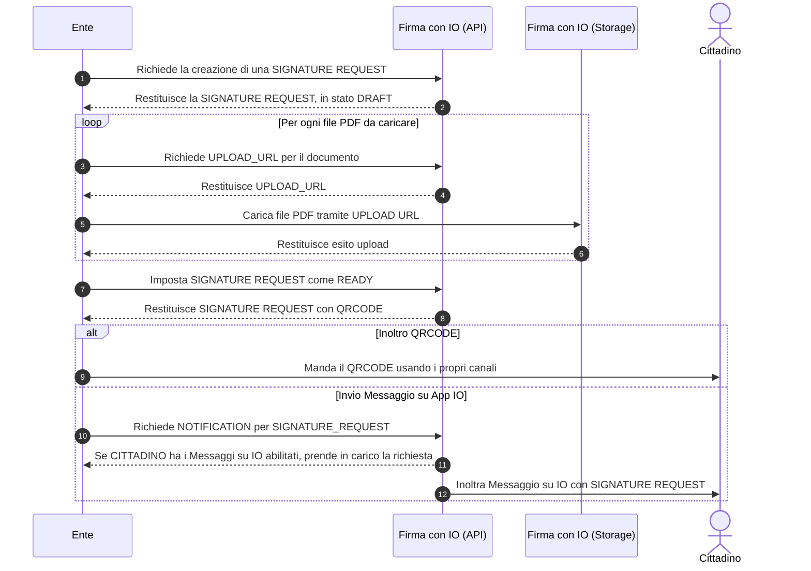

# ✍️ Request a signature

Once the documents have been prepared in one of the supported formats and the signature fields have been entered, follow these steps to request a signature from the user:

<mark style="color:blue;">Step 1</mark>: Create a dossier

[To discover how to do this, click here](../create-the-dossier.md)

<mark style="color:blue;">Step 2</mark>: Recover the ID of the citizen

[To discover how to do this, click here](recovery-of-citizen-id.md)

<mark style="color:blue;">Step 3</mark>: Create a <strong>Signature Request</strong>

[To discover how to do this, click here](creation-of-a-signature-request.md)

<mark style="color:blue;">Step 4</mark>: Upload the documents

[To discover how to do this, click here](upload-of-documents.md)

<mark style="color:blue;">Step 5</mark>: Send the request for a signature

[To discover how to do this, click here](send-the-request-for-a-signature/)

This sequence diagram outlines the process for creating a “Signature request”, once the "Signer ID" and "Dossier ID" are obtained

