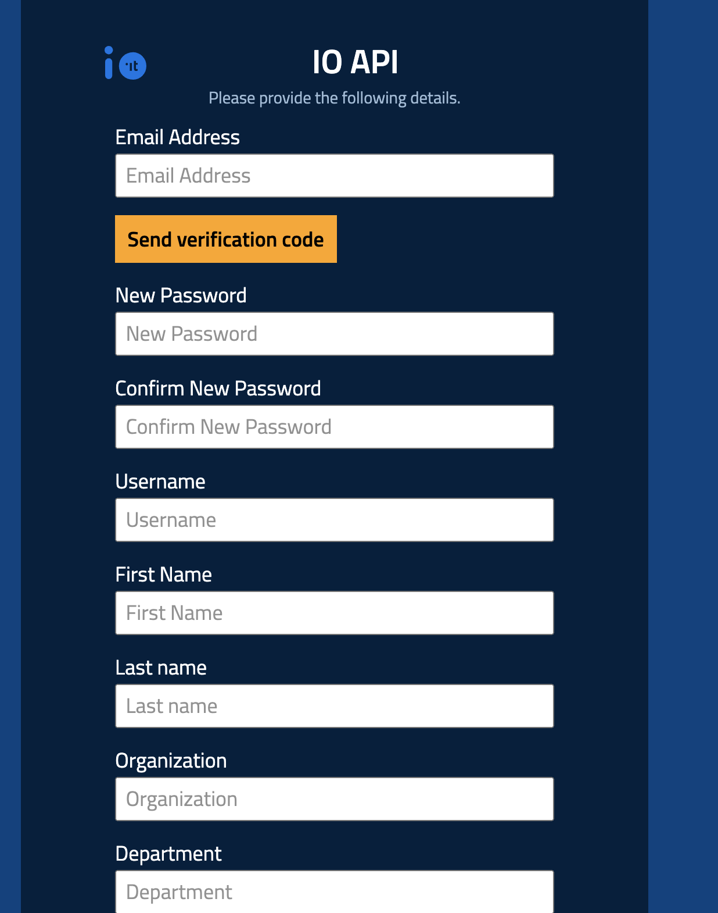

# Iscrizione al Developer Portal


Il Developer Portal è ancora in funzione, ma verrà dismesso nei prossimi mesi.


Il primo passo per utilizzare le API di IO è l’[**iscrizione al Developer Portal**](https://developer.io.italia.it/)**.**

Per completare l’iscrizione dovrai validare un indirizzo email, un numero di cellulare e inserire i dati anagrafici e di riferimento dell’ente.

<figure><figcaption></figcaption></figure>

## Sandbox

Al termine di questi passaggi preliminari, potrai testare soltanto le seguenti API di IO utilizzando il cittadino di test con Codice Fiscale **`AAAAAA00A00A000A`**:

- [Submit a Message passing the user fiscal\_code in the request body](https://developer.io.italia.it/openapi.html#operation/submitMessageforUserWithFiscalCodeInBody);
- [Submit a Message passing the user fiscal\_code as path parameter](https://developer.io.italia.it/openapi.html#operation/submitMessageforUser);
- [Get Message](https://developer.io.italia.it/openapi.html#operation/getMessage);
- [Get a User Profile using POST](https://developer.io.italia.it/openapi.html#operation/getProfileByPOST);
- [Get a User Profile](https://developer.io.italia.it/openapi.html#operation/getProfile);
