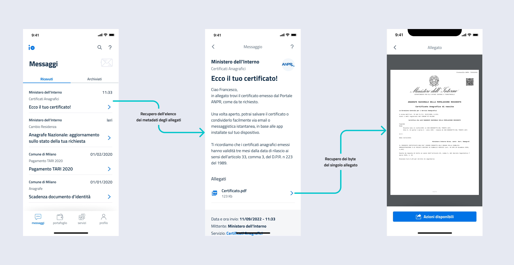

# Adding attachments


This feature is reserved for organizations that have subscribed to the [Premium program](../../Authorizations/Premium-features.md).


## What are attachments

They are documents in PDF format, shown at the bottom of the message content. These attachments are retrieved from the sending organization's systems **every time** the user accesses the resource in the IO app.

<figure><figcaption><p>When the user opens a message, metadata for the attachments is retrieved in addition to the message content metadata (endpoint 1). The actual file is retrieved via endpoint 2, i.e. with a GET request to the address <code>{baseUrl}/messages/{id}/{url}</code></p></figcaption></figure>


To ensure the accessibility and security of the documents, you _must_ use attachments in **PDF/A-2a** format: make sure you comply with this specification.


## How does it work?

<details>

<summary><mark style="color:blue;">Step 1</mark> - Define a Remote Configuration</summary>

To allow IO to know about your systems dedicated to attachments, **you must define at least one** [**Remote Configuration**](../../Initial-setup/Remote-configuration.md), which you will specify later when [sending each message](Sending-a-message-with-remote-content.md).

</details>

<details>

<summary><mark style="color:blue;">Step 2</mark> - Expose the attachment retrieval endpoints</summary>

To allow IO to retrieve the content of a message and its attachments, **you must provide a&#x20;**_**REST web service**_ that complies with the [relevant OpenAPI](https://editor.swagger.io/?url=https://raw.githubusercontent.com/pagopa/io-backend/master/openapi/consumed/api_remote_content.yaml).

For more information, read the [openapi-endpoint-di-recupero-dei-contenuti-remotizzati.md](../../api-e-specifiche/openapi-endpoint-di-recupero-dei-contenuti-remotizzati.md "mention").

</details>

To include attachments in a message, in addition to the steps indicated in [Sending a message](./), you must follow these steps:

<details>

<summary><mark style="color:blue;">Step 3</mark> - Include the <a data-mention href="../../api-e-specifiche/api-messaggi/submit-a-message-passing-the-user-fiscal_code-in-the-request-body.md#third_party_data">#third_party_data</a> block</summary>

Include the [#third\_party\_data](../../APIs-and-specifications/Message-APIs/Submit-a-message-passing-the-user-fiscal-code-in-the-request-body.md#third_party_data "mention") block, specifying the reference [configurazione-remota.md](../../setup-iniziale/configurazione-remota.md "mention") and the remote correlation `id`, which IO will return to you when it asks for the metadata and, subsequently, the bytes of the attachments for the particular message you are sending.

</details>

<details>

<summary><mark style="color:blue;">Step 4</mark> - Specify the value <code>TRUE</code> in the <a data-mention href="../../api-e-specifiche/api-messaggi/submit-a-message-passing-the-user-fiscal_code-in-the-request-body.md#has_attachments">#has_attachments</a> field</summary>

Specify the value `true` in the [#has\_attachments](../../APIs-and-specifications/Message-APIs/Submit-a-message-passing-the-user-fiscal-code-in-the-request-body.md#has_attachments "mention") field present in the [#third\_party\_data](../../APIs-and-specifications/Message-APIs/Submit-a-message-passing-the-user-fiscal-code-in-the-request-body.md#third_party_data "mention") block.

</details>

<details>

<summary><mark style="color:blue;">Step 5</mark> - Specify the value <code>ADVANCED</code> in the <a data-mention href="../../api-e-specifiche/api-messaggi/submit-a-message-passing-the-user-fiscal_code-in-the-request-body.md#feature_level_type">#feature_level_type</a> field</summary>

Specify the value `ADVANCED` in the [#feature\_level\_type](../../APIs-and-specifications/Message-APIs/Submit-a-message-passing-the-user-fiscal-code-in-the-request-body.md#feature_level_type "mention") field in the request.

</details>

### Examples

Example of a call to send a message with attachments:



```shell
curl --location --request POST 'https://api.io.pagopa.it/api/v1/messages' \
--header 'Ocp-Apim-Subscription-Key: <YOUR_API_KEY>' \
--header 'Content-Type: application/json' \
--data-raw '{
  "content": {
    "subject": "Message with attachments",
    "markdown": "# Title\n\nMessage text: contains **attachments**!",
    "third_party_data": {
      "id": "c7832d5f-5946-48a3-ba9d-2d1e3aa3f7e5", 
      "configuration_id": "0e9852ccb8a04128bd637c807b9d80d3",
      "has_attachments": true
    }
  },
  "feature_level_type": "ADVANCED",
  "fiscal_code": "<validFiscalCode>",
}'
```



Example of a successful response:



```json
{
  "id": "01BX9NSMKVXXS5PSP2FATZMYYY"
}
```




Note that you are not actually sending the attachments when the message is created: you will do this later, when the recipient wants to view them in the app and IO invokes [the API you exposed](../../APIs-and-specifications/OpenAPI-endpoint-for-retrieving-remote-content.md#endpoint-di-recupero-dei-byte-del-singolo-allegato) for this purpose

