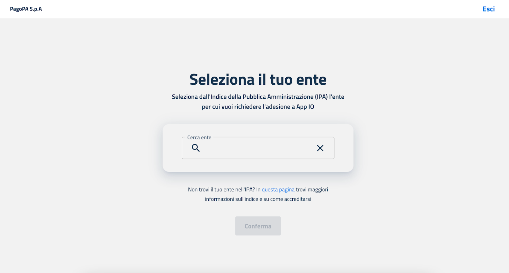

# Onboarding via the Reserved Area

Before you can use the IO APIs, your organization must have an active basic membership. If it does not have one, the first step is to complete the [_onboarding process for the IO App_](https://selfcare.pagopa.it/onboarding/prod-io) through the Reserved Area.

<figure><figcaption></figcaption></figure>

During the onboarding process, you will need to enter the details of:

1. a **legal representative** of the organization;
2. one or more **Administrators**, i.e., the people who will have full permissions on that product.

Once this data is entered, the Reserved Area **will send a contract** to the requesting organization's certified email address (PEC). This must be **digitally signed** by the legal representative and **uploaded** to the Reserved Area via the _magic link_ provided in the certified email.
