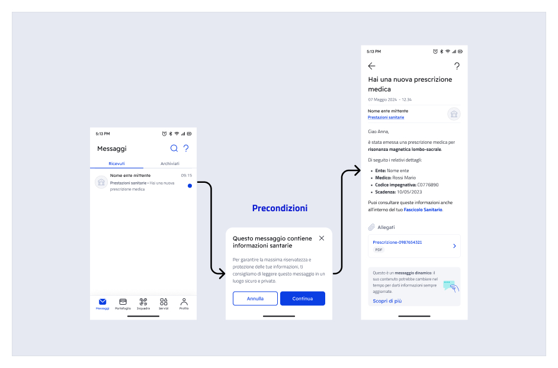

# Sending a message with remote content

### What are remote content messages?

Remote content messages address the need to convey **communications containing citizens' personal and/or sensitive data** through IO, ensuring their management complies with privacy regulations. In fact, by choosing this sending method, **the information is not stored on IO**, but is retrieved from your systems each time the user accesses the message in the app.&#x20;

For a message, the remote-able content is:

- title;
- body;
- opening preconditions (optional, e.g. disclaimer);
- attachments (Premium).

### What changes?

#### 📐 Architecture

Unlike the traditional sending method, where message content is transmitted to IO's systems upon creation, remote messages require that such **content resides exclusively on your systems**, and IO will retrieve it each time the recipient user wants to view it in the app.

<figure><figcaption><p>Sequence of the main phases in the two sending scenarios</p></figcaption></figure>

In this way, IO acts as a **real-time communication** channel between you and your user, holding only the necessary information to allow message retrieval and status verification.


Managing remote messages implies that your organization is responsible for the content conveyed through IO, particularly regarding its **accuracy** and **availability** to the user.


#### 🕵️‍♂️ Managing sensitive information

As specified, remote messages are designed to ensure the _privacy-compliant_ sending of personal/sensitive information related to the recipient, **where necessary for service provision.**&#x20;


We remind you that this sending method **does not change your obligations under current regulations**, particularly under art. 7.3 of the [IO Guidelines](https://www.agid.gov.it/it/linee-guida#index-8).


As an additional privacy protection measure, the [#require\_secure\_channels](../../api-e-specifiche/api-messaggi/submit-a-message-passing-the-user-fiscal_code-in-the-request-body.md#require_secure_channels "mention") flag allows you to **mark a message as containing sensitive information**, with the following effects:

- push notifications on the recipient's devices will show a generic invitation to open the message, without displaying the title's content;
- messages will not be forwarded via email, regardless of the preference set by the recipient user.


You can also set the `require_secure_channels` flag [directly on the service](../pubblicare-un-servizio/dati-obbligatori/attributi.md#require_secure_channels), so you don't have to worry about doing it for every single message.


#### ✏️ Updating content over time

Unlike traditional messages, remote content messages can be modified **even after being sent**: for example, you can correct a typo or dynamically update information that is no longer valid or is misleading (e.g. following the cancellation of an appointment).&#x20;

When considering this possibility, it is good to remember that:

- The recipient user **will not receive any notification** if the content of a previously received message is updated. In fact, the content can only be updated, by retrieving it from your systems, when and if the user opens the message in the app;
- The responsibility for the information transmitted via IO remains, in any case, with the sending entity.


In principle, when the context that generated a message changes or new information needs to be transmitted, it is always preferable to **send a new message** to inform the recipient.

If in doubt, always prioritize maintaining **informational consistency** for your users: messages on IO are an important business card for your organization, [ensure their quality](https://docs.pagopa.it/manuale-servizi/comunicare-un-servizio/i-canali)!&#x20;


<details>

<summary>Use case: appointment booking - Example of updating message content after sending</summary>

1. Your entity sends a remote content message to the recipient citizen to confirm the booking of an appointment for a healthcare service:
2. The recipient reads the message and decides to cancel the appointment through the channels you have made available for managing bookings;
3. Your entity sends the same user a **new message** to confirm the cancellation;
4. To ensure informational consistency, your entity **updates the content of the first message**, replacing and/or deleting the appointment confirmation information and obsolete references.

</details>

To make the recipient aware that the content may be updated over time, the following notice has been included at the bottom of the details of all remote content messages, in its short and extended versions:

<figure><figcaption><p>Short notice, at the bottom of the message</p></figcaption></figure>

<figure><figcaption><p>Extended notice, available via the "Learn more" CTA </p></figcaption></figure>


**IO does not perform any checks** on the immutability of the content of a remote content message over time. The accuracy and availability of the information contained in the message are always the sole responsibility of the sending Entity.



As the data controller, you must directly guarantee users the exercise of their rights as data subjects under the GDPR, and any such request will be redirected to you. For example, the right of access under Art. 15 of the GDPR must be guaranteed to data subjects who request it, also through the contact details provided in the service information sheet.


### How does sending a remote content message work?


Before you can send remote content messages, you must follow the procedure outlined in [remote-configuration.md](../../setup-iniziale/configurazione-remota.md "mention")


The lifecycle of a remote content message consists of two main stages:

- The **sending** (creation) by your organization's systems;
- The **consumption** (viewing) by the recipient.

<figure><figcaption><p>The two main phases of a remote content message's lifecycle</p></figcaption></figure>

Both phases require an integration between your systems and IO's systems.

### Message sending phase

#### Creating the remote content message

In this phase, it is your systems integrated with IO that request the creation (and therefore sending) of a new message to a specific recipient. For more information on sending a message on IO, refer to [.](./ "mention").

The following table summarizes the main remote-able components of an IO message:

<table><thead><tr><th width="197">Component</th><th>Flag to set</th><th>Notes</th><th data-hidden data-type="checkbox">Remote-able?</th></tr></thead><tbody><tr><td>preconditions</td><td><a data-mention href="../../api-e-specifiche/api-messaggi/submit-a-message-passing-the-user-fiscal_code-in-the-request-body.md#has_precondition">#has_precondition</a></td><td>This is <em>optional</em> information, which is displayed <em>before opening the message details</em>. </td><td>false</td></tr><tr><td>title (subject)</td><td><a data-mention href="../../api-e-specifiche/api-messaggi/submit-a-message-passing-the-user-fiscal_code-in-the-request-body.md#has_remote_content">#has_remote_content</a></td><td>This is the title visible <em>when opening the message</em>, which differs from the one visible in the message list (not remote-able).</td><td>true</td></tr><tr><td>body (markdown)</td><td><a data-mention href="../../api-e-specifiche/api-messaggi/submit-a-message-passing-the-user-fiscal_code-in-the-request-body.md#has_remote_content">#has_remote_content</a></td><td>This is the text content of the message.</td><td>true</td></tr><tr><td>payment notice details</td><td></td><td>They are already remote thanks to the integration with the pagoPA node.</td><td>true</td></tr><tr><td>attachments (PDF)</td><td><a data-mention href="../../api-e-specifiche/api-messaggi/submit-a-message-passing-the-user-fiscal_code-in-the-request-body.md#has_attachments">#has_attachments</a></td><td>This content can only be managed remotely. You can include them if you have subscribed to the Premium Agreement. The accepted format is PDF.</td><td>true</td></tr></tbody></table>

<details>

<summary>Important information about preconditions for opening the message</summary>

As the sending entity, you can decide that the opening of the message should be preceded by content aimed at informing the recipient about particular aspects or circumstances related to the message itself.

Preconditions are an intermediate screen between the message list and the details of the selected message. The user accesses the message details only if they select the "Continue" button.&#x20;



In effect, displaying preconditions **leads to an interruption in the message reading flow**. Therefore, it is best to use them only in scenarios where they actually add value to your communication or are otherwise required by current regulations, in order not to degrade the user experience.

**When to use them:**
When it is necessary to draw the citizen's attention to fundamental information, and in any case when required by applicable law, for example, in legally valid communications where opening the message has legal effects for the citizen.

**When not to use them:**
To convey notices that are not strictly related to the message content or to add detailed information that can be provided within the message or at other points in the user experience.

</details>

<details>

<summary>Important information about the message title (subject) in relation to the "has_remote_content" flag</summary>

The message title is used by the IO app on three occasions:

1. as the visible title in the received messages list;
2. as the header of the message detail, once opened;
3. in the text of push notifications linked to the message (where enabled by the user and where the message/service is not marked by you as conveying sensitive information)

Depending on the value of the [#has\_remote\_content](../../api-e-specifiche/api-messaggi/submit-a-message-passing-the-user-fiscal_code-in-the-request-body.md#has_remote_content "mention") flag you specify in [#third\_party\_data](../../api-e-specifiche/api-messaggi/submit-a-message-passing-the-user-fiscal_code-in-the-request-body.md#third_party_data "mention") (see later in this chapter), the **message title** will behave differently:

- if [#has\_remote\_content](../../api-e-specifiche/api-messaggi/submit-a-message-passing-the-user-fiscal_code-in-the-request-body.md#has_remote_content "mention")`=true`, the [#subject](../../api-e-specifiche/api-messaggi/submit-a-message-passing-the-user-fiscal_code-in-the-request-body.md#subject "mention") field specified at message creation is used by IO in the received messages list, as the push notification text, and as the subject of any forwarded email, but not in the message detail view in the app: this is instead retrieved later (see [#what-happens-when-the-recipient-opens-a-remote-message](inviare-un-messaggio-a-contenuto-remoto.md#cosa-succede-quando-il-destinatario-apre-un-messaggio-remotizzato "mention")).**This means the recipient might see different texts in the message details and elsewhere**. We recommend not to substantially differentiate the title, in order to maintain informational consistency between the two texts. Furthermore, we remind you that according to the IO Guidelines, it is not possible to include sensitive information in the message title.
- if [#has\_remote\_content](../../api-e-specifiche/api-messaggi/submit-a-message-passing-the-user-fiscal_code-in-the-request-body.md#has_remote_content "mention")`=false` or if you do not include the flag, the [#subject](../../api-e-specifiche/api-messaggi/submit-a-message-passing-the-user-fiscal_code-in-the-request-body.md#subject "mention") field has the standard behavior of a traditional (non-remote) message: the same text content is used in the message details and in all other contexts mentioned above.

</details>

<details>

<summary>Important information about the message body (markdown)</summary>

When creating a remote content message ( [#has\_remote\_content](../../api-e-specifiche/api-messaggi/submit-a-message-passing-the-user-fiscal_code-in-the-request-body.md#has_remote_content "mention")`=true`), it is still necessary, in compliance with the IO API interface, to define a **non-remote "courtesy" text (markdown)**, which will be used to compose the message forwarding email that IO users can choose to receive when a message is delivered to them in the app.

**Markdown limits for forwarding:** min 80, max 134 characters; beyond that, the system truncates with an ellipsis.

**Note on forwarding messages via email:** If enabled by the end-user, a message sent via IO can be forwarded to their email address. The email contains the beginning of the message body (the first 134 characters), as well as an invitation to open the app to access the full content via a CTA that allows redirection. Here is an example of a forwarded email:

.png>)

</details>


**Note on attachments (Premium)**
If you have subscribed to the Premium Agreement, your messages can also include **attachments** in PDF format: these will also be transmitted directly from your systems to the app when the recipient opens the message. For more information, refer to [adding-attachments.md](aggiungere-allegati.md "mention")


For remote content messages, it is _mandatory_ to include the following additional information in the [#third\_party\_data](../../api-e-specifiche/api-messaggi/submit-a-message-passing-the-user-fiscal_code-in-the-request-body.md#third_party_data "mention") block:

<table><thead><tr><th width="237">Field</th><th>Field description</th></tr></thead><tbody><tr><td><a data-mention href="../../api-e-specifiche/api-messaggi/submit-a-message-passing-the-user-fiscal_code-in-the-request-body.md#id">#id</a></td><td>This is the <strong>remote correlation identifier</strong>, which uniquely identifies a specific message addressed to a specific recipient. This identifier, <strong>determined by you</strong>, consists of a string that <strong>allows the APIs</strong> to retrieve the remote content for that specific message.</td></tr><tr><td><a data-mention href="../../api-e-specifiche/api-messaggi/submit-a-message-passing-the-user-fiscal_code-in-the-request-body.md#configuration_id">#configuration_id</a></td><td>In this field, indicate the identifier you received during <a data-mention href="../../setup-iniziale/configurazione-remota.md">remote-configuration.md</a>: IO will use this data to determine the set of information needed to call the REST <em>endpoints</em> exposed by your Organization that will serve the remote data for this message.</td></tr><tr><td><a data-mention href="../../api-e-specifiche/api-messaggi/submit-a-message-passing-the-user-fiscal_code-in-the-request-body.md#has_precondition">#has_precondition</a></td><td><p>Set this field only if you want the recipient, upon opening the message in the app, to be shown a text (with its title) containing <strong>contextual information</strong> that you will provide at that time (for more information refer to <a data-mention href="../../api-e-specifiche/openapi-endpoint-di-recupero-dei-contenuti-remotizzati.md#endpoint-di-recupero-delle-precondizioni-allapertura-del-messaggio">#endpoint-for-retrieving-preconditions-upon-message-opening</a>): after reading the text, <strong>the recipient can choose whether to continue opening the message</strong> or return to the received messages list; the possible values for this field are:</p><ul><li><code>NEVER</code> (default)</li><li><code>ONCE</code> (preconditions are shown only the first time the recipient tries to open the message)</li><li><code>ALWAYS</code> (preconditions are shown every time, even if the message has been read before)</li></ul></td></tr><tr><td><a data-mention href="../../api-e-specifiche/api-messaggi/submit-a-message-passing-the-user-fiscal_code-in-the-request-body.md#has_remote_content">#has_remote_content</a></td><td>Set the field to <code>true</code> <strong>if you want the message title (subject) and body to be remote</strong>; when IO requests them via the specific API you have exposed, you must respond with a text string for the title and a <em>markdown</em> for the body, just as you would have specified when creating a traditional message; the default for this field is <code>false</code>.<br>For more information and to understand the role of the title in a remote content message, refer to <a data-mention href="../../api-e-specifiche/openapi-endpoint-di-recupero-dei-contenuti-remotizzati.md#endpoint-di-recupero-dei-dettagli-del-messaggio">#endpoint-for-retrieving-message-details</a></td></tr><tr><td><a data-mention href="../../api-e-specifiche/api-messaggi/submit-a-message-passing-the-user-fiscal_code-in-the-request-body.md#has_attachments">#has_attachments</a></td><td>Set the field to <code>true</code> if you want <strong>one or more PDF documents to be attached</strong> to the message: as illustrated in <a data-mention href="../../api-e-specifiche/openapi-endpoint-di-recupero-dei-contenuti-remotizzati.md#endpoint-di-recupero-dei-dettagli-del-messaggio">#endpoint-for-retrieving-message-details</a>, when IO requests the message details, you will need to provide the attachment metadata (name and its URL); when the recipient selects an attachment in the app, IO will retrieve the bytes from your systems via the specific API described in <a data-mention href="../../api-e-specifiche/openapi-endpoint-di-recupero-dei-contenuti-remotizzati.md#endpoint-di-recupero-dei-byte-del-singolo-allegato">#endpoint-for-retrieving-the-bytes-of-a-single-attachment</a>.<br>Remember that you can only set this flag if the entity has subscribed to IO's Premium Agreement.</td></tr></tbody></table>


Regardless of whether it is remote, if the message conveys **sensitive information**, you _must always_ set the [#require\_secure\_channels](../../api-e-specifiche/api-messaggi/submit-a-message-passing-the-user-fiscal_code-in-the-request-body.md#require_secure_channels "mention")`=true` flag


### Message consumption phase

#### What happens when the recipient opens a remote content message?

In this phase, IO uses the flags you indicated during creation to determine how to compose the message in the app, and then proceeds with the eventual retrieval of remote data and its integration with the data it already possesses to present the final result to the recipient.


Each call from IO to your systems is identified by the remote correlation [#id](../../api-e-specifiche/api-messaggi/submit-a-message-passing-the-user-fiscal_code-in-the-request-body.md#id "mention") you specified during [#creating-the-remote-message](inviare-un-messaggio-a-contenuto-remoto.md#creazione-del-messaggio-remotizzato "mention") and, as a _header_, the recipient's [#fiscal\_code](../../api-e-specifiche/api-messaggi/submit-a-message-passing-the-user-fiscal_code-in-the-request-body.md#fiscal_code "mention").


In particular, if during [#creating-the-remote-message](inviare-un-messaggio-a-contenuto-remoto.md#creazione-del-messaggio-remotizzato "mention") you specified [#has\_precondition](../../api-e-specifiche/api-messaggi/submit-a-message-passing-the-user-fiscal_code-in-the-request-body.md#has_precondition "mention") with the value `ONCE` or `ALWAYS`, as soon as the recipient selects the message from the message list in the app without having ever read it before (`=ONCE`) or every time (`=ALWAYS`), IO will retrieve the endpoint to call from the configuration information, and **will invoke your systems** to **obtain the title and text of the preconditions** in response, to be displayed in the pop-up panel of the [#opening-preconditions](inviare-un-messaggio-a-contenuto-remoto.md#precondizioni-allapertura "mention").

In response to the API call to the [#endpoint-for-retrieving-preconditions-upon-message-opening](../../api-e-specifiche/openapi-endpoint-di-recupero-dei-contenuti-remotizzati.md#endpoint-di-recupero-delle-precondizioni-allapertura-del-messaggio "mention"), you must respond as in the example:



```json
{
    "title": "This is the title of the preconditions",
    "markdown": "This is the text of the preconditions in **markdown** format"
}
```



The preconditions panel has two buttons: "Cancel" and "Continue".

If the recipient selects "**Continue**", IO will proceed with displaying the message in the app; otherwise, the user will be returned to the message list.

If during [#creating-the-remote-message](inviare-un-messaggio-a-contenuto-remoto.md#creazione-del-messaggio-remotizzato "mention") you specified [#has\_remote\_content](../../api-e-specifiche/api-messaggi/submit-a-message-passing-the-user-fiscal_code-in-the-request-body.md#has_remote_content "mention")`=true`, the message title and body will be retrieved upon opening via a call that IO will make to the API you exposed (for details, refer to [#endpoint-for-retrieving-message-details](../../api-e-specifiche/openapi-endpoint-di-recupero-dei-contenuti-remotizzati.md#endpoint-di-recupero-dei-dettagli-del-messaggio "mention")).


As in the traditional model, you can also add an expiration date ([#due\_date](../../api-e-specifiche/api-messaggi/submit-a-message-passing-the-user-fiscal_code-in-the-request-body.md#due_date "mention")) and data related to a debt position ([#payment\_data](../../api-e-specifiche/api-messaggi/submit-a-message-passing-the-user-fiscal_code-in-the-request-body.md#payment_data "mention")) to a remote content message; this information is already remote thanks to the integration with the pagoPA node.

