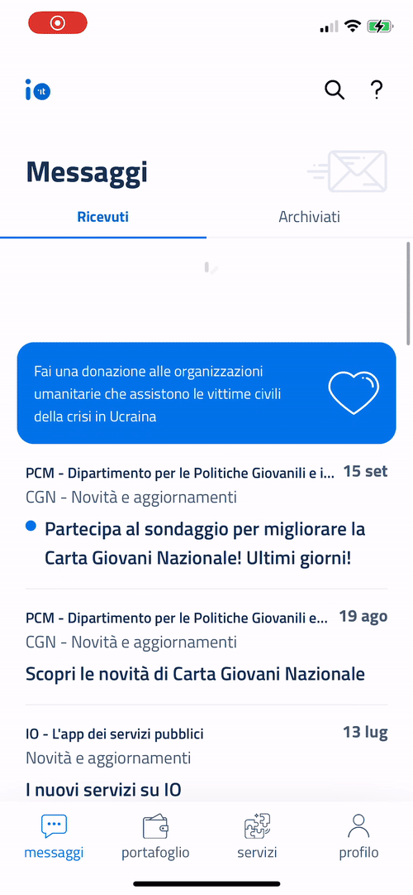

# Testing a service in test

You can view the details page of a service in test that is not yet visible in IO. Follow these instructions.


**Important**: make sure you can send messages to your Fiscal Code. [Learn how ->](../../abilitazioni/test-con-codici-fiscali-reali.md)


<mark style="color:blue;">Step 1</mark> - Create a test service

If you haven't already done so, find out how [.](./ "mention").

<mark style="color:blue;">Step 2</mark> - Send a message

Send a message, via the [specific endpoint](../../api-e-specifiche/api-messaggi/submit-a-message-passing-the-user-fiscal_code-in-the-request-body.md), to your Fiscal Code using the service you just created.

<mark style="color:blue;">Step 3</mark> - Open the message in the app

Wait for the message to arrive in the app, then select it to view its content.

You can force the message list to update by swiping down (pull to refresh).

<mark style="color:blue;">Step 4</mark> - Open the service details page

At the bottom of the message, you will find the name of the service that sent it: select it to view the service's details page.

