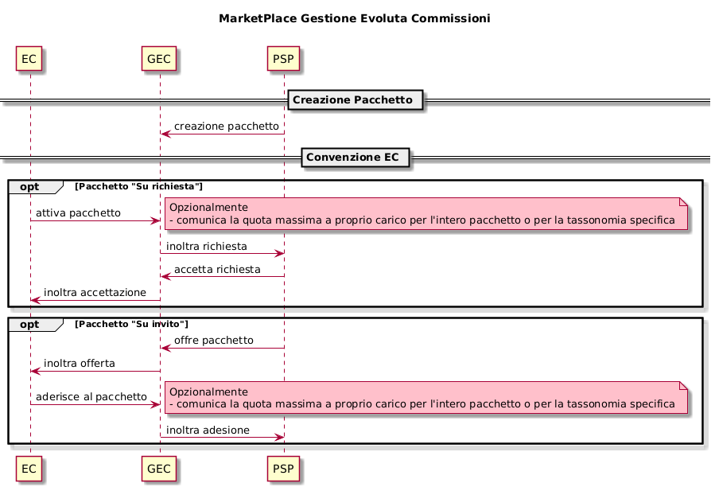

---
metaLinks:
  alternates:
    - >-
      https://app.gitbook.com/s/EnBg5c1okkV2J4KL0TcG/appendici/gestione-evoluta-commissioni
---

# Advanced commission management

PagoPA S.p.A has implemented this service that introduces a rules engine for conditioning all payment operations on the platform, giving PSPs the opportunity to create ad hoc commission packages for specific payments that guarantee greater flexibility based on

- different commissions with respect to the EC
- touchpoint
- debt position taxonomy
- amount
- chosen payment method
- period

for each "On request" and "By invitation" commission package, each EC has the option to set the share it will cover, and can also associate it with specific taxonomies.

## Marketplace

This is the tool that allows ECs to subscribe to certain packages ('on request' or 'by invitation') offered by PSPs, and also to complete the packages with information about the commissions they will cover.

Each PSP can define 3 types of commission packages

- 'For everyone' → available for payments from any EC;
- 'On request' → available only for payments from ECs that have activated a 'subscription' via the marketplace;
- 'By invitation' → available only for payments from ECs that have activated a 'subscription' via the marketplace at the invitation of the PSP;

<figure><figcaption></figcaption></figure>

### Use cases

- Each PSP has CRUD interfaces available to manage commission packages;
- each PSP can define an amount for each package;
- each PSP can define a transaction amount range for each package;
- each PSP can associate a payment method with each package;
- each PSP can associate a touchpoint with each package;
- each PSP can associate a taxonomy code with each package;
- each PSP can associate a validity period with each package;
- each PSP can offer its 'by invitation' packages to ECs;
- each PSP can accept subscription requests from ECs for its 'on request' packages;
- each PSP can accept subscription modifications from ECs for its 'on request' packages;
- each EC has CRUD interfaces available to manage the packages to which it has access;
- each EC can cover a commission share for each 'on request' or 'by invitation' package to which it has access;
- each EC can associate a filter by taxonomy code for the commission share it wants to cover;
- each EC can request to subscribe to an 'on request' package;
- each EC can modify its subscription to an 'on request' package;
- each EC can accept or reject the offer of a 'by invitation' package.

For more information about using the features, refer to:

Manual for ECs -> [https://developer.pagopa.it/pago-pa/guides/manuale-bo-ec/manuale-operativo-back-office-pagopa-ente-creditore/funzionalita/gestione-evoluta-commissioni](https://developer.pagopa.it/pago-pa/guides/manuale-bo-ec/manuale-operativo-back-office-pagopa-ente-creditore/funzionalita/gestione-evoluta-commissioni)

Manual for PSPs -> [https://developer.pagopa.it/pago-pa/guides/manuale-bo-psp/manuale-operativo-pagamenti-pagopa-prestatore-di-servizi-di-pagamento/funzionalita/gestione-evoluta-commissioni](https://developer.pagopa.it/pago-pa/guides/manuale-bo-psp/manuale-operativo-pagamenti-pagopa-prestatore-di-servizi-di-pagamento/funzionalita/gestione-evoluta-commissioni)
