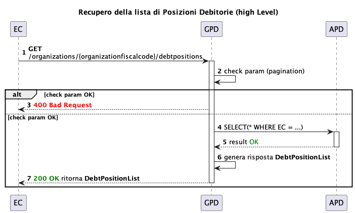
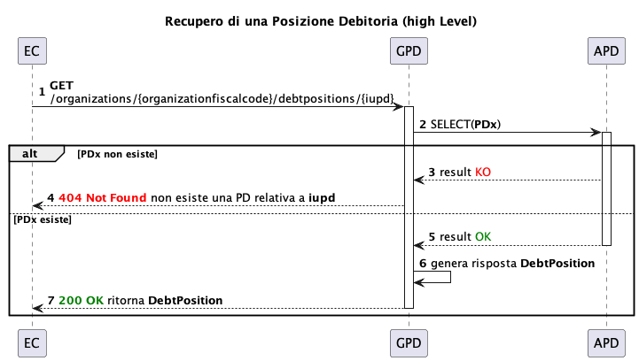
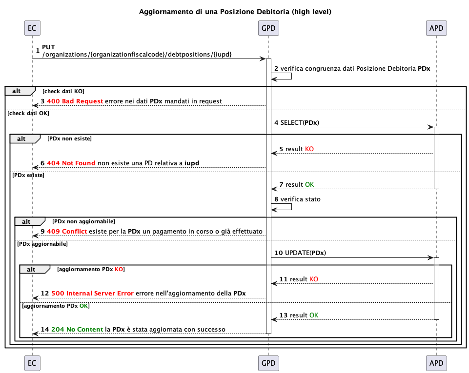
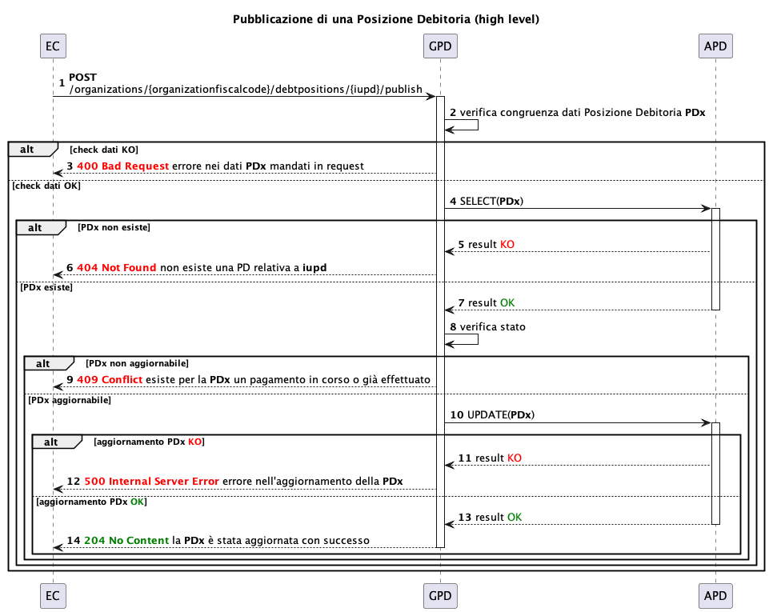
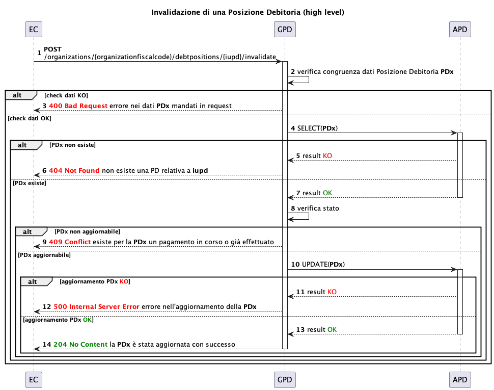
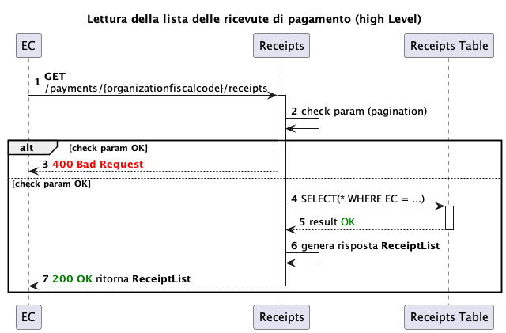
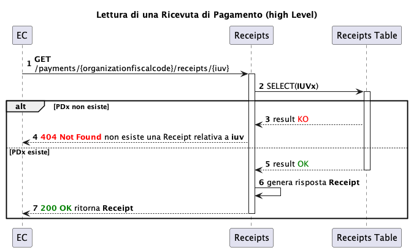
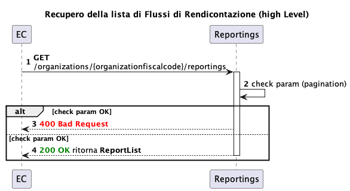
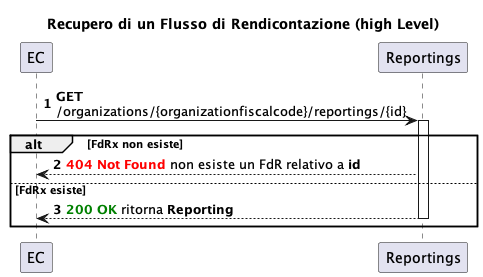

---
metaLinks:
  alternates:
    - >-
      https://app.gitbook.com/s/EnBg5c1okkV2J4KL0TcG/appendici/posizioni-debitorie/operazioni-disponibili
---

# Available operations

## Debt Position Management

In the following sequence diagrams, the acronym GPD identifies the Debt Position Management service and APD the Debt Position Archive (database).

For details, see [https://developer.pagopa.it/it/pago-pa/api/gestione-posizioni-debitorie](https://developer.pagopa.it/it/pago-pa/api/gestione-posizioni-debitorie?spec=GPD%20con%20gestione%20opzioni%20di%20pagamento).

The APIs have a cumulative _rate limit_ of 450 requests every 10 seconds.

### Creating a debt position

.png>)

When creating the debt position, the service will perform checks on the input data and for any duplicates.

Input data checks include:

- mandatory data
- date consistency (e.g. `due_date` ≥ `validity_date`)
- amount consistency (e.g. the sum of the payment amounts must equal the total amount)
- taxonomy validity
- validity of IBANs (must be registered on the pagoPA platform)

Duplicate identification is based on the IUPD, IUV, NAV and fiscalCode identifiers.

The operation to create the debt position may fail if it already exists for the calling Creditor Entity that owns the same debt position.

### Reading a list of debt positions and a single debt position

Reading a list of debt positions always involves pagination. It is also possible to filter by `due_date` to limit the results. The request may fail due to invalid input, for example, the number of items requested per page being greater than the maximum allowed, or inconsistent date ranges.

Reading a debt position is based on the input identifier (`IUPD`). If the `IUPD` does not exist, an error will be returned.

### Updating a debt position

During an update, in addition to the checks already mentioned during creation, it is also verified that the position exists and can be updated. In particular, the updatability of the debt position depends on its status. For example, if a debt position has already been paid in full or in part, reported, or invalidated, it cannot be updated and an error will be returned.

### Deleting a Debt Position

.png>)

Deleting a debt position involves checks on both its existence (`IUPD`) and status. A debt position cannot be deleted if it has already been paid.

### Publishing a debt position

Publishing the debt position allows changing its status from `DRAFT` to `PUBLISHED.` A position in the `DRAFT` (draft) status, in fact, does not allow normal operation on the pagoPA platform. Only when the Creditor Entity publishes the position, consistent with its validity and due dates, does it become payable on the platform. If the IUPD indicated in the request does not correspond to a debt position in the `DRAFT` state belonging to the requesting Creditor Entity, the request returns an error.

### Invalidating a debt position

Invalidating a debt position is, in effect, a logical deletion. This can only be done if the debt position to be invalidated is in the `PUBLISHED` and `VALID` states. This functionality is useful when you want to inform the user, during payment, that the debt position has been invalidated. If the IUPD indicated in the request does not correspond to a debt position belonging to the requesting Creditor Entity, the request returns an error.

## Payment receipts

Two REST APIs are available for retrieving payment receipts:

- list of payment receipts
- single receipt details.

<figure><figcaption></figcaption></figure>

Viewing the list of payment receipts involves applying a time filter. If no specific interval is provided, the search automatically shows data from the last 3 months. To limit the results, it is also possible to filter the search by debtor.

The request results are returned in a paginated format.

<figure><figcaption></figcaption></figure>

Reading a payment receipt is based on the input identifier (`IUV`). If the `IUV` does not exist or there is no receipt associated with it, an error will be returned.

The two APIs share a cumulative rate-limit of 100 requests every 10 seconds.

## Reporting flows

Features are available for reading reporting flows:

- List of reporting flows for a Creditor Entity
- Reporting flow details


Enabling the service for managing reporting flows on GPD is not automatic and must be explicitly requested when onboarding the Creditor Entity.


Reading a list of reporting flows always involves pagination. It is also possible to specify the start date from which to select the flows.

Reading a reporting flow is based on the input reporting identifier (`id`). If no reporting flow exists for the `id` entered in the request, an error will be returned.


With the introduction of REST Reporting Flows, this feature is deprecated as of **31/12/2026** and will be permanently decommissioned starting **31/07/2027**.


