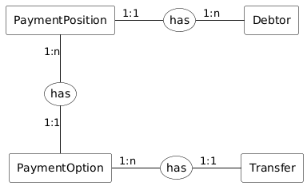

---
metaLinks:
  alternates:
    - >-
      https://app.gitbook.com/s/EnBg5c1okkV2J4KL0TcG/appendici/posizioni-debitorie/modello-dei-dati-v1
---

# Data Model V1

### Logical Schema (ER)

The **Posizione Debitoria (Payment Position)** has the following relationships:

- A **Payment Position** is linked to a **Debtor**. If a **Debtor** exists, at least one **Payment Position** is linked to it.
- A **Payment Position** can have multiple **Payment Options**. There is at least one. A **Payment Option** is linked to only one **Payment Position**.


_For example, some of the most common payment options for an annual tax are:_

- _single installment_

- _first installment_

- _..._

- _nth installment_
  

- A **Payment Option** can have multiple **Transfers**, as many as the Creditor Entities (EC) to which it must be sent. There is _at least one and a maximum of five_. A **Transfer** is linked to only one **Payment Option**.


_For example, a payment option could have the following breakdown:_

- _single-beneficiary payment, with a single transfer (1 EC, 1 transfer);_

- _single-beneficiary payment, with multiple transfers (1 EC, n transfers);_

- _multi-beneficiary payment (n EC, n transfers);_

- _a combination of the previous points (n EC, m transfers with m>n)._
  

- Both the **Payment Option** and the **Transfer** can have multiple Metadata items; each Metadata item can be associated with multiple Payment Options or Transfers. There are two types of Metadata: **PaymentOptionMetadata** and **TransferMetadata**.

The following paragraphs describe the main characteristics of a Payment Position. More technical details about the system's logic and the state transitions dependent on the specified fields are provided in the section on Payment Position States.

#### Payment Position (Posizione Debitoria)

The main characteristics of a Payment Position are as follows:

- **IUPD**: Unique payment position identifier.&#x20;


The EC is responsible for creating a unique IUPD. If it is not unique, the system will return an error.


- **Creditor Entity** `organization-fiscal-code` : Tax code of the creditor entity that owns the PP.
- **Creditor Entity Details**: Company name `companyName`, office `officeName`.
- **Publication Date** `publishDate` : Date on which the PP is published in the system.
- **Validity Date** `validityDate` : Date from which the Payment Position and the Payment Options it contains are valid and payable.&#x20;


The EC is responsible for managing the PP and all its associated information, including the validity date.


- **Expiration**_\[flag]_ `switchToExpired` : Indicates whether the PP should be made unpayable upon expiration.

#### Debtor (Debitore)

The main characteristics of a Debtor are as follows:

- **Type** `type` : Indicates whether it is a natural or legal person.
- **Identifier** `fiscalCode` : Tax code (or VAT number for a legal person) of the debtor.
- **Full name** `fullName` : Full name, first name and last name.
- **Address** _\[optional]_ `streetName`, `civicNumber`, `postalCode`, `city`, `province`, `region`, `country`.
- **Email** _\[optional]_ `email`.
- **Phone number** _\[optional]_ `phone`.

#### Payment Option (Opzione di Pagamento)

The main characteristics of a Payment Option are as follows:

- **Notice Number (NAV)** `nav` : Identifier of the notice issued by a specific Creditor Entity; it will be the identifier used by the Payment Hub to initiate the transaction, issue the receipt, and report the payment.
- **Unique Payment Identifier (IUV)** `iuv` : Unique identifier for each Payment Option.
- **Amount** `amount` : Amount due for the Payment Option.
- **Description** `description` : Description of the Payment Option.
- **Due date** `dueDate` : Date that defines the due date for the payment. It affects payability if the expiration flag is active.
- **Metadata** _\[optional]_ `paymentOptionMetadata` : Array to allow ECs to enter custom information typically related to accounting reconciliation, ERP alignment, etc.

#### Transfer (Versamento)

The main characteristics of a Transfer are as follows:

- **Id** `idTransfer` : Identifier (sequential) of a transfer within a Payment Option.
- **Creditor Entity** `organizationFiscalCode` : Beneficiary entity of the transfer.
- **Amount** `amount` : Amount due for the transfer.
- **Remittance information** `remittanceInformation` : Reason for the individual transfer.
- **Taxonomy** `category` : Taxonomy of the service associated with the transfer.
- **IBAN** `iban`**,** `postalIban` : IBAN to which the amount will be transferred.
- **Metadata** _\[optional]_ `transferMetadata` : Array to allow ECs to enter custom information.


The IBAN is associated with the **PP** when it is uploaded. If the chosen IBAN is modified from the [Back Office](https://developer.pagopa.it/pago-pa/guides/manuale-bo-ec/v1.0/manuale-operativo-back-office-pagopa-ente-creditore/funzionalita/gestione-iban/modifica-iban), the previously uploaded **PP** will always have the IBAN that was associated during its creation.

