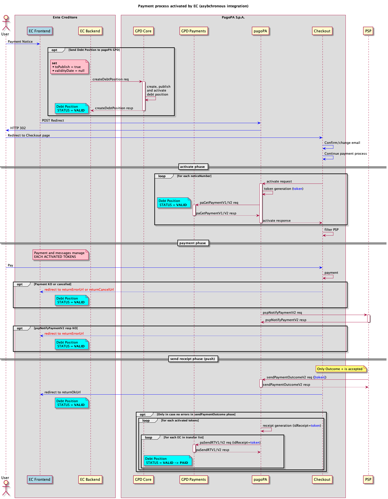

---
metaLinks:
  alternates:
    - >-
      https://app.gitbook.com/s/EnBg5c1okkV2J4KL0TcG/appendici/posizioni-debitorie/pagamenti-presso-frontend-dellec-in-modalita-asincrona
---

# Payments at the EC's frontend in asynchronous mode

This page provides a possible integration flow for a payment initiated from the EC's frontend, in case it is in production on the pagoPA platform in asynchronous mode.


The flow described in this section is for illustrative purposes only and should therefore not be considered a mandatory implementation specification.


The purpose of _payments at the EC's frontend in asynchronous mode_ is to ensure that, in all cases where the debt position cannot be pre-loaded, it is present on the PagoPA debt position service before the payment activation phase.

<figure><figcaption></figcaption></figure>

- When the EC's frontend receives a payment request for one or more notices, before forwarding the request to Checkout via a [redirect](../../creditor-entity/integration-methods/ec-touchpoint-integration-with-Checkout.md), it proceeds to load the relevant debt positions by invoking the [`createDebtPosition`](Available-operations.md) API exposed by the _GPD-Core_ component;
- in order to create, publish, and set the debt positions to the `VALID` state with a single invocation to the _GPD-Core_ component, it is suggested to set the `toPublish=true` query parameter and the `validityDate=null;` field of the debt position
- at this point, the debt positions are present within the PagoPA **debt positions** service and are in the correct state to be paid;
- Checkout, based on the number of notices it has received, asks the Node to activate the _n_ payments; in turn, the Payment Node will forward the requests to the _GPD-Payments_ component, which will respond to the [paGetPaymentV2](../Primitives/Creditor-Entity/api-soap.md#pagetpayment-versione-2) primitive on behalf of the EC;
- the payment process proceeds unchanged as described on the [Payment at the EC's frontend](../../use-cases/payment-at-the-ec's-frontend.md) page until the invocation of the [paSendRTV2](../Primitives/Creditor-Entity/api-soap.md#pasendrt-versione-2) primitive, which, in the case of asynchronous integration, is forwarded to the _GPD-Payments_ component and possibly to the configured broadcast stations;
- The direct EC or the intermediary must make an endpoint available that adheres to the specifications in the [Connectivity](../connectivity.md#nodo-dei-pagamenti-client) section, where the [paSendRTV2](../Primitives/Creditor-Entity/api-soap.md#pasendrt-versione-2) service must be exposed. This will allow PagoPA S.p.A. to configure a **broadcast station** on which to send the _receipts_ in real time as payments are successfully completed. This configuration facilitates the EC's receipt of payment receipts in **push mode,** without having to implement polling mechanisms towards the [APIs ](Available-operations.md#ricevute-di-pagamento)exposed by the `GPD-Core` component. The [APIs](Available-operations.md#ricevute-di-pagamento) for retrieving _receipts_ can be used in special cases, such as a technical problem while receiving one or more _receipts_ via the broadcast station;
- when the `GPD-Payments` component receives the _receipt_, it proceeds to close the debt position.
