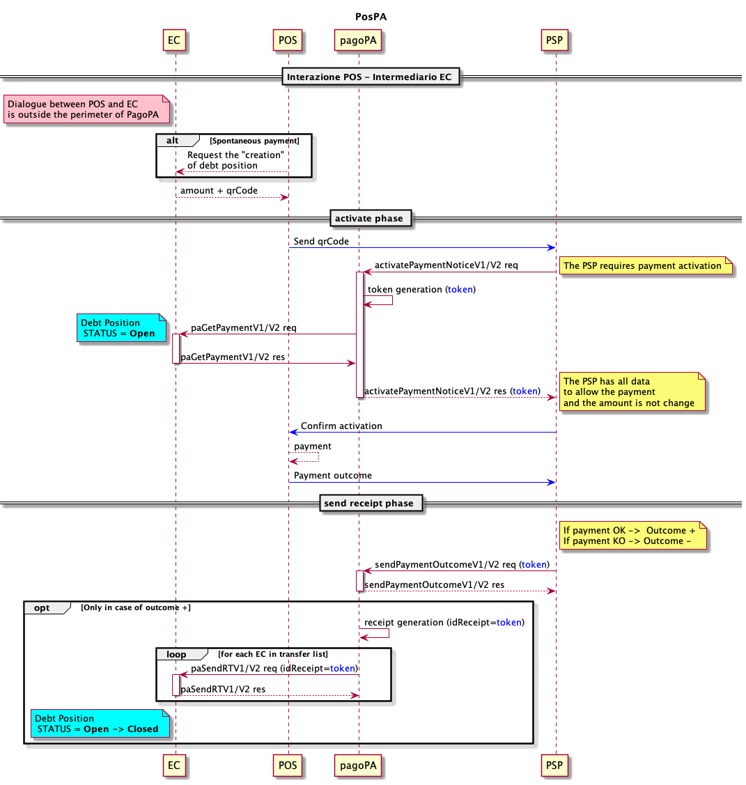

---
metaLinks:
  alternates:
    - https://app.gitbook.com/s/EnBg5c1okkV2J4KL0TcG/appendici/pos-fisici
---

# Direct Management-POS Integration

Being _purely for guidance_, the content of the current page is immediately applicable and aims to encourage card payments in all possible payment scenarios, providing guidance to both PSPs and all types of ECs participating in pagoPA, outlining the features of a payment service compatible with the implementation specifications of the pagoPA platform.

<figure><figcaption></figcaption></figure>

- The prerequisite for the payment is that the debit position has been previously created by the EC and communicated to the POS with its essential data, _qrCode_ and _amount_;
- the _qrCode_ must be exchanged with the PSP so that the latter can proceed with the activation;
- with the [activatePaymentNotice](../primitive/#activatepaymentnotice), the PSP asks the node to activate the payment with the EC; this phase is mandatory for PSPs. To correctly identify the payment type in the _touchPoint_ tag, the value "POS" must be entered;
- the payment activation request reaches the EC through the [paGetPayment](../primitive/#pagetpayment);
- the activation confirmation is forwarded to the POS, which then allows the payment and forwards its outcome to the PSP;
- the PSP is MANDATORILY required to provide the payment outcome in real-time with the [sendPaymentOutcome](../primitive/#sendpaymentoutcome) as soon as the end-user has paid or confirmed on the PSP's touchpoint, and in any case, no later than the token's expiration, both in case of a successful payment (outcome = OK) and a failed payment (outcome = KO);
- through the [paSendRT](../primitive/#pasendrt) primitive, the _receipt_ (receipt) is forwarded to the _n_ ECs involved in the payment only if the payment has been completed; the _receipt_ is an object generated by the pagoPA platform;
- when the EC receives the _receipt_, it must close the debit position and consider it fully settled.

For error handling, refer to [Error Handling](https://app.gitbook.com/o/KXYtsf32WSKm6ga638R3/s/mU2qgiLV1G3m9z1VjAOc/ "mention").
