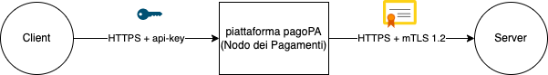

---
metaLinks:
  alternates:
    - https://app.gitbook.com/s/EnBg5c1okkV2J4KL0TcG/appendici/connettivita
---

# Connectivity

An entity intending to interact with the pagoPA system can activate and manage a direct connection with the pagoPA platform. The term "direct connection" refers to the set of redundant links between a primary and a secondary site (to be activated in case of disaster recovery) of the entity directly connected to the corresponding primary and secondary sites from which the pagoPA platform provides its services. The sizing of the direct connection is determined by the entity intending to connect directly, in compliance with the availability, performance, and security requirements indicated in this document.

The pagoPA platform is reachable by default from the Internet.

In any case, the entity intending to connect directly (regardless of the method) must ensure the use of redundant, high-performance connectivity for both the primary site and the secondary site dedicated to disaster recovery.

## Connection to pagoPA via the Internet

An entity can connect directly to the pagoPA platform using Internet connectivity, in compliance with the following constraints:

- use of the https transport protocol with an encrypted and authenticated channel via Transport Layer Security (TLS) version 1.2 or higher, enabling mutual authentication between the parties (client-authentication) for outbound connectivity from the Payments Hub and using an API key for inbound connectivity to the Payments Hub. To this end, the use of x.509 digital certificates is mandatory for creating the TLS channel. It should be noted that in the pagoPA system, the directly connected entity will be authenticated by the pagoPA platform both when receiving requests (API key) and when sending them (server authentication).
- use of a connection adequate to support compliance with the expected SLAs, considering the volume of transactions the entity plans to carry out.

## Connection activation procedure

### Payments Hub as a server

New subscriptions will be processed by generating API keys on the pagoPA BackOffice portal, which can be accessed via the [PagoPA Reserved Area](https://selfcare.pagopa.it/). For all information regarding the subscription process for the PagoPA Reserved Area, please refer to the following link: [Reserved Area - How to Subscribe](https://docs.pagopa.it/area-riservata/area-riservata/come-aderire).

The complete procedure for obtaining the API keys is described in the BackOffice-pagoPA operational manuals for Creditor Institutions, PSPs, and Technology Partners.

The procedure in the manuals is valid for all pagoPA system environments (test and production).

Once generated, the API keys are made available on the pagoPA BackOffice portal. It is the applicant's responsibility to manage the keys according to best practices and not to disclose them. In the event of suspected theft or compromise, they must be regenerated immediately.

The API keys do not expire and both are valid. Typically, the primary key is always used; the secondary key can be useful if it becomes necessary to regenerate the primary key for specific security reasons.

The key must be passed as input in all calls the client makes to the pagoPA platform by setting the `Ocp-Apim-Subscription-Key` HTTP header. If the HTTP header is not set, or if the key is incorrect or no longer valid, the APIM will respond with an HTTP 401 error.

The activation procedure concludes with a test of mutual system reachability.

### Payments Hub as a client

The procedure described below is valid for all pagoPA system environments (test and production):

1. the entity intending to connect directly to the pagoPA platform must obtain an x.509 digital certificate issued by a Certification Authority that is a member of the CA/Browser Forum ([https://cabforum.org/members/](https://cabforum.org/members/)). PagoPA S.p.A. reserves the right to authorize the connection using a certificate issued by a different CA and to authorize the connection to the external test environment using another type of certificate;
2. the Subject field of each certificate must contain a CN consistent with the FQDN of the URL for the service it intends to expose;
3. the URL of the application service to be exposed must be provided for proper configuration in the pagoPA system infrastructure, and it must follow the format `<PROTOCOL>`://`<FQDN>`:`<PORT>`/`<CONTEXT\_PATH>`, for example, https://myservice.subservice.it:443//context/subcontext. The FQDN must match the CN specified in point 2;
4. when establishing a connection to the interested entity, the pagoPA system enables mutual authentication (mTLS). The entity can publicly download the platform's x.509 digital certificate from the following links:

- Test: [https://raw.githubusercontent.com/pagopa/pagopa-node-forwarder/main/certs/forwarder.uat.platform.pagopa.it.pem](https://raw.githubusercontent.com/pagopa/pagopa-node-forwarder/main/certs/forwarder.uat.platform.pagopa.it.pem)​
- Production: [https://raw.githubusercontent.com/pagopa/pagopa-node-forwarder/main/certs/forwarder.platform.pagopa.it.pem](https://raw.githubusercontent.com/pagopa/pagopa-node-forwarder/main/certs/forwarder.platform.pagopa.it.pem)​

The activation procedure concludes with a test of mutual system reachability.
