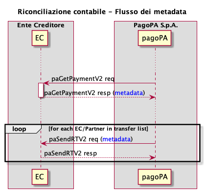

---
metaLinks:
  alternates:
    - >-
      https://app.gitbook.com/s/EnBg5c1okkV2J4KL0TcG/ente-creditore/riconciliazione-contabile
---

# Accounting reconciliation

The EC must complete the payment life cycle by verifying that the bank flow matches the reporting flow. To do so, it uses the reporting flow identifier from the payment transfer description, matching it with the corresponding reporting flow downloaded from the pagoPA platform. After this procedure, the verified amounts must be allocated to the correct budget items to allow for reversal entries and to complete the accounting reconciliation process.

To transmit information useful for accounting reconciliation on the pagoPA platform, it is necessary to use the _metadata_ structure available in the [paGetPayment vers. 2](../appendix/Primitives/Creditor-Entity/api-soap.md#pagetpayment-versione-2) and [paSendRT vers. 2](../appendix/Primitives/Creditor-Entity/api-soap.md#pasendrt-versione-2).

For a correct and standardized use of _metadata_, a specific [Metadata Dictionary](https://app.gitbook.com/o/KXYtsf32WSKm6ga638R3/s/u6YdY319vyFX9MIvnKBa/ "mention") has been created, which includes a section dedicated to accounting reconciliation.

- in the _response_ to the payment activation request, which reaches the EC via the [paGetPayment vers.2](../appendix/Primitives/Creditor-Entity/api-soap.md#pagetpayment-versione-2), it is possible to insert the _metadata_ for each individual transfer;
- via the [paSendRT vers. 2](../appendix/Primitives/Creditor-Entity/api-soap.md#pasendrt-versione-2), which is sent to the _n_ ECs involved in the payment via their Technology Partners/Intermediaries, forwards the _metadata_ that had been inserted in the [paGetPayment vers. 2](../appendix/Primitives/Creditor-Entity/api-soap.md#pagetpayment-versione-2) _response_;
- the [paSendRT vers. 2](../appendix/Primitives/Creditor-Entity/api-soap.md#pasendrt-versione-2) is forwarded
  - to the primary EC's _station_, from which the payment was activated;
  - to the _stations_ of all ECs configured as _broadcast_;

By leveraging this flow, each software of the ECs involved in the payment could receive the [paSendRT vers. 2](../appendix/Primitives/Creditor-Entity/api-soap.md#pasendrt-versione-2) and use the content of the _metadata_ to manage accounting reconciliation.
