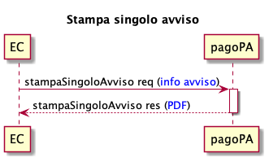
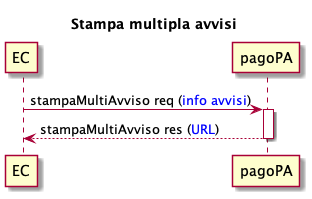

---
metaLinks:
  alternates:
    - >-
      https://app.gitbook.com/s/EnBg5c1okkV2J4KL0TcG/ente-creditore/stampa-avvisi-pagopa
---

# Print pagoPA notices

This new functionality provides ECs with a new primitive for printing the pagoPA payment notice in PDF format, thus allowing ECs to manage the entire lifecycle of the notice, from generation to printing.

Using this functionality allows the Creditor Entity to significantly simplify the debt position management process by delegating the notice printing lifecycle to PagoPA through a simple integration and, in the future, transparently in case of joining other initiatives (e.g., [integrazione-tramite-api-asincrone.md](modalita-dintegrazione/integrazione-tramite-api-asincrone.md "mention")).

In any case, the Creditor Entity remains responsible for the correctness of the debt position data communicated to PagoPA S.p.A. for the purposes of this service. Regarding the processing of personal data, the Creditor Entity is the data controller for the personal data related to the debt position. Unless otherwise indicated in writing, the Creditor Entity adopts the "Agreement on the processing of personal data by the data processor pursuant to Article 28 of Regulation (EU) 2016/679," thereby appointing PagoPA S.p.A. as Data Processor. The agreement is available at the following link:



Should the Creditor Entity use a Technology Intermediary and/or Technology Partner as the data processor for the personal data of the debt position, the latter must adopt the aforementioned Agreement, unless otherwise indicated in writing. PagoPA S.p.A. will therefore act as a sub-processor for the Creditor Entity, assuming for this specific case a general authorization from the Controller to the Processor to use other processors.

In the event that the Creditor Entity communicates its intention not to adopt the Data Processing Agreement and/or its subsequent amendments and updates, adhesion to the service will remain suspended until the processing of personal data is governed by another agreement pursuant to Art. 28 of Regulation (EU) 2016/679. All specifications regarding the use of the new functionality for printing pagoPA notices are available at the link:

[Print payment notices.](https://app.gitbook.com/o/KXYtsf32WSKm6ga638R3/s/9jfvPZ8QjCKuOGYxe5Uc/)

## **Print single notice**

<figure><figcaption></figcaption></figure>

- The EC sends all the necessary information to stampaSingoloAvviso, as indicated in the section [#informazioni-richieste-per-la-stampa-dellavviso-di-pagamento](print-pagoPA-notices.md#informazioni-richieste-per-la-stampa-dellavviso-di-pagamento "mention");
- stampaSingoloAvviso responds with the PDF of the requested _payment notice_, compliant with the specifications described in [Payment notices](https://docs.pagopa.it/avviso-pagamento).

## **Print multiple notices**

<figure><figcaption></figcaption></figure>

- The EC sends all the necessary information to stampaMultiAvviso, as indicated in the section [#informazioni-richieste-per-la-stampa-dellavviso-di-pagamento](print-pagoPA-notices.md#informazioni-richieste-per-la-stampa-dellavviso-di-pagamento "mention");
- stampaMultiAvviso will provide the URL where you can download all the requested _payment notice_ PDFs, compliant with the specifications described in [Payment notices](https://docs.pagopa.it/avviso-pagamento).

## **Information required for printing the payment notice**

To use the functionality, the EC must send the following information for each Payment Notice:

_Header_

- subject of the Notice, clear and meaningful text for the notice recipient.

_Information about the Creditor Entity_

- Tax Code or VAT number of the Creditor Entity;
- name of the Creditor Entity;
- name of the organizational unit that manages the payment.

_Information about the recipient_

- Tax Code (or, if unavailable, VAT number) of the payer;
- full name of the payer;
- address of the payer.

_Amount and due date_

- Payment due date;
- payment amount.

_Where to pay_

- Optional fixed text listing the Creditor Entity's website (or app) among the available channels, if it allows payment of the notice;
- optional text mentioning the Creditor Entity's physical channel, if it allows payment of the notice.

_Payment data_

- Two-dimensional barcode / Data Matrix;
- notice code;
- interbank code of the Creditor Entity, also known as the SIA Code.
