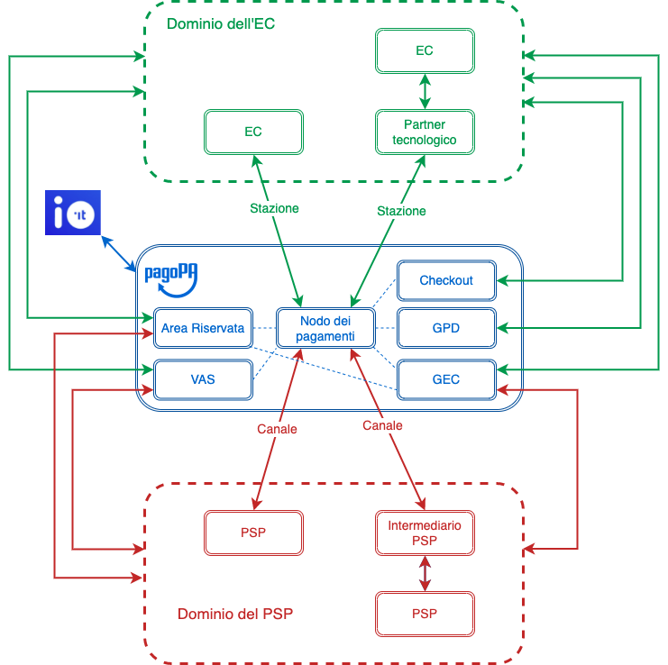

---
metaLinks:
  alternates:
    - >-
      https://app.gitbook.com/s/EnBg5c1okkV2J4KL0TcG/specifiche-attuative-del-nodo-dei-pagamenti-spc/funzionamento-generale/component-overview
---

# Component overview

On this page, we describe the purpose of each component of the pagoPA platform, without going into detail about the modules or actors belonging to the domain of the Creditor Entity or the Payment Service Provider.

<figure><figcaption>
Macro-components of the pagoPA platform
</figcaption></figure>

## Payments Hub

This is the main macro-component which aims to coordinate the execution of service requests, managing the entire workflow in the various planned payment notice use cases and in all possible EC integration options.

The _Payments Hub_ interfaces with both the applications of the ECs to which the service requests are addressed and with the PSPs that enable payment on the various channels.

It includes various software components, the main ones of which are those that allow:

- the storage and management of "payment requests" for tracing operations and handling exceptions;
- error handling, as defined in [Error Handling](https://app.gitbook.com/o/KXYtsf32WSKm6ga638R3/s/mU2qgiLV1G3m9z1VjAOc/ "mention");
- monitoring the service levels of each party involved, as defined in [quality-indicators-for-adhering-subjects](../../appendici/indicatori-di-qualita-per-i-soggetti-aderenti/ "mention");
- the management of the "stand-in" functionality in case of unavailability or non-response from the EC;

## Debt Position Management (GPD) 

This component allows integration with the Payments Hub through REST APIs by ECs for all asynchronous features described in detail in [debt-positions](../../appendici/posizioni-debitorie/ "mention").

## Advanced Fee Management (GEC) 

This component allows integration with the Payments Hub to enable the features described in detail in [advanced-fee-management.md](../../appendici/gestione-evoluta-commissioni.md "mention").

## Checkout

The pagoPA [checkout.md](../../casi-duso/pagamento-da-touchpoint-pagopa/checkout.md "mention") component is a web app for desktop and mobile that allows payments to be made on the pagoPA platform starting from the data contained in the payment notice, without requiring any registration from users.

The Checkout component also provides support functions to the end user, introducing various measures to simplify the _user experience_, including for payments made with mobile devices.

## IO

It allows you to easily interact with various Public Administrations, local or national, collecting all their services, communications, payments, and documents in a single app, securely and always at your fingertips.

The app allows you to pay directly from a message or paper notice, reducing collection times and costs for the Entity.

## Reserved Area

A B2B portal that, through access with SPID or CIE credentials, will be the primary interface channel for PSPs, Creditor Entities, their potential partners/technological integrators, and all of the Company's products, including the pagoPA platform.\
The portal was created to offer the various parties involved a single place from which to activate and integrate any of PagoPA's products, in order to simplify the onboarding procedures for individual platforms and, subsequently, to configure and manage the related services autonomously.

The entity can specify administrative and technical contacts (internal) or technological partners (external), authorize them to integrate a specific product, and change these delegations at any time. Similarly, delegated technical contacts can access the portal to perform the necessary integration operations only for the entities from which they have received a delegation and only on the products for which they have been authorized.

The introduction of the new B2B portal will constitute a single back office and will allow entities to autonomously manage - from their reserved area - all products in a simple, coherent, and standardized way, reducing the integration and configuration effort, which is currently carried out via email and manual processes.

Onboarding and the signing of contracts and agreements will be automated.

Access to the new B2B portal will be via SPID or CIE, and each administrative contact can delegate a subset of functionalities to different user profiles.

For example:

- Functionalities for PSPs:
  - informative data catalog configuration
  - key and certificate management for access to primitives
  - download billing reports
- Functionalities for ECs:
  - station registration
  - IBAN registration
  - key and certificate management for access to primitives
  - download billing reports for premium features
  - service catalog configurations for spontaneous payments

## Value-Added Services (VAS)

The _VAS_ component exposes a series of APIs for both ECs and PSPs.

## Stations and Channels 

The adhering parties, ECs and PSPs, connect to the platform through _stations_ and _channels,_ respectively, which represent the technological platforms of partners and intermediaries connected through the forms and methods described in the [connectivity.md](../../appendici/connettivita.md "mention") section.
