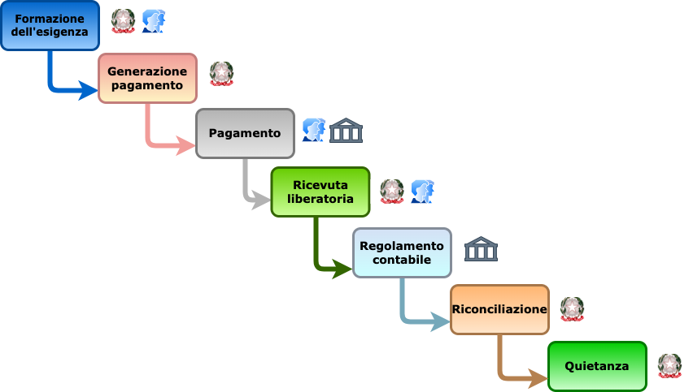

---
metaLinks:
  alternates:
    - >-
      https://app.gitbook.com/s/EnBg5c1okkV2J4KL0TcG/specifiche-attuative-del-nodo-dei-pagamenti-spc/funzionamento-generale/ciclo-di-vita-di-un-pagamento
---

# Payment lifecycle

Payment through the pagoPA platform is a complex operation consisting of several phases that generally follow a predefined “Lifecycle”. This lifecycle is governed by administrative procedures that require compliance with rules for their correct execution. This “Lifecycle” can be represented by the flowchart in the following figure.

