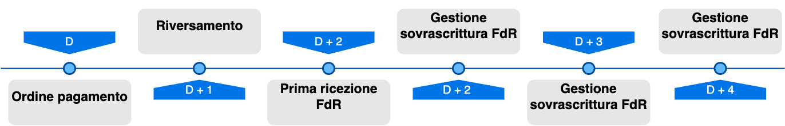

---
metaLinks:
  alternates:
    - >-
      https://app.gitbook.com/s/EnBg5c1okkV2J4KL0TcG/specifiche-attuative-del-nodo-dei-pagamenti-spc/funzionamento-generale/rendicontazione-e-cashflow
---

# Reporting and Cashflow

Each PSP participating in the platform, on day **D+2**, reports via the **reporting flow** the details of the transfers made on day **D+1** to the credit accounts for payments made on operating day **D**, as defined in the pagoPA platform Guidelines, specifically in the [SACI. ](https://app.gitbook.com/o/KXYtsf32WSKm6ga638R3/s/QdpcBdgV6Vin3SHiZyFM/)

PagoPA provides EC/PSP with REST [primitives](../../appendici/primitive/#nuova-gestione-flussi-di-rendicontazione) for managing the download/upload of FdRs.&#x20;

ECs and PSPs will be able to adapt their calls to the primitives provided by the pagoPA platform to efficiently manage FdRs.

To use the APIs, you must subscribe to the product that provides the primitives listed below. For more information on how to request a subscription to a new product, please refer to the manuals on creating new API Keys for [ECs](https://developer.pagopa.it/it/pago-pa/guides/manuale-bo-ec/v1.0/readme/funzionalita/generazione-api-key) and [PSPs](https://developer.pagopa.it/it/pago-pa/guides/manuale-bo-psp/v1.0/readme/funzionalita/generazione-api-key).

Two new products are made available:

- **"FDR - Reporting Flows \[ORG]"** - API for Creditor Entities
- **"FDR - Reporting Flows \[PSP]"** - API for PSPs

The diagram of the new process is shown below:

<figure><figcaption></figcaption></figure>

The process involves the introduction of several steps, described in the following paragraphs.

It is also important to note that all time references are based on the UTC timezone.

In this transition phase between the old (SOAP) and the new (REST) reporting flow management, the following assumptions are made during the translation process:

| SOAP reporting flow                                                                                                                                                                                                             | REST reporting flow                                                                                     |
| ------------------------------------------------------------------------------------------------------------------------------------------------------------------------------------------------------------------------------- | ------------------------------------------------------------------------------------------------------- |
| Dates are specified using the UTC timezone (e.g.  `<dataOraFlusso>2026-04-10T12:59:12.989Z</dataOraFlusso>}`)                                                                | Dates are kept with the same UTC timezone.                                              |
| Dates are specified without a timezone (e.g.  `<dataOraFlusso>2026-04-10T12:59:12.989</dataOraFlusso>}`)                                                                     | It is implicitly assumed that the starting timezone is CET, and it is converted to UTC. |
| Dates are specified with a timezone (e.g.  \<dataOraFlusso>2026-04-10T12:59:12.989+06:00\</dataOraFlusso>) | It is converted to the UTC timezone.                                                    |

Examples of the calls can be found on the [developer portal.](https://developer.pagopa.it/pago-pa/api/flussi-di-rendicontazione)

#### **Available actions for sending and managing reporting flows**

**On the PSP side:**

1. **Start flow upload:**
   The PSP starts the process by notifying the system of its intention to send a new reporting flow, whose name must be unique within the reference year of the payment transactions. In this step, it sets all the characteristic information of the flow, such as the total reported by the flow, the number of payments included in the flow, the receiving entity, and so on. This operation is allowed only if no other flows with the same name have already been created and are awaiting publication.
2. **Send packets:**
   The PSP sends the references of the payments to be included in the reporting flow to the system. The flow can be populated by dividing the insertion into multiple packets with a maximum size of 1000 payments, sent and managed independently. This operation can be repeated until the flow is complete. If the insertion of a specific packet fails, all payments included in it are not inserted into the reporting flow, and it is therefore possible to send it again without conflicts. This operation is allowed only if the flow has not already been published. To ensure uniform traffic usage, a limit of 50 requests per second and 600 requests per minute is applied to each PSP.
3. **Delete a packet:**
   If a single payment or a previously sent packet needs to be removed from the reporting flow, the PSP can decide to delete it permanently. If the deletion of a specific payment packet fails, all payments included in it are not removed from the reporting flow, and it is therefore possible to perform the operation again without conflicts. This operation is allowed only if the flow has not already been published. To ensure uniform traffic usage, a limit of 50 requests per second and 600 requests per minute is applied to each PSP.&#x20;
4. **Publish the flow:**
   After sending all the payment packets, the PSP can publish the reporting flow to make it available to the Creditor Entities (ECs). This operation is allowed only if the flow has not already been published.
5. **Delete the entire flow:**
   As an alternative to publication, the PSP can decide to delete an entire flow and all its associated payment packets. If the deletion fails, all payments included in it are not removed from the reporting flow, and it is therefore possible to perform the operation again without conflicts. This operation is allowed only if the flow has not already been published.

#### **On the Creditor Entity side:**

1. **Request the list of available flows:**
   The EC can request the list of reporting flows associated with it. It is only possible to retrieve reporting flows from the last 30 days. The list service is paginated, and it is allowed to request a maximum of 1000 items per page.
2. **Download a specific flow:**
   After obtaining the list, the EC can request the download of a single reporting flow. If the requested flow is very large, it must be downloaded in paginated form, retrieving the payments divided into blocks. It is only possible to retrieve reporting flows from the last 30 days.

### Revisions of Reporting Flows

A PSP has the ability to submit the same reporting flow using the same identifier. This feature is useful when you want to send a revised and corrected version of a previously published reporting flow.&#x20;

If the reporting flow has not yet been published, it is necessary to first delete the draft flow, then repeat the entire process: creation, adding payments, and publication. This helps to avoid the proliferation of incorrect versions of the reporting flow.&#x20;

All revisions published by a PSP can be consulted by the recipient EC, should the need arise. The API dedicated to consulting reporting flows allows the EC to obtain, for each flow, the main information related to the latest available revision. From there, it is possible to directly retrieve the latest published version or search among previous revisions by specifying the revision number. Since the system does not record which flows have already been downloaded by the EC, it is up to the EC to manage the processing status independently, distinguishing between already acquired flows and those yet to be retrieved. It is important to consider that a PSP might generate new revisions of a given flow, if necessary. For proper management, the EC must therefore check and monitor the revision and content of the received flow, keeping in mind that any new versions can occur until 00:00 on the fourth working day (D+4) after receiving the payment order.

A PSP can therefore send a flow with the same identifier (the `fdr` field of the flow creation request) multiple times, but in compliance with specific rules. The system accepts a new revision of the same reporting flow only if the date associated with it (the `fdrDate` field of the flow creation request) is later than that of the last published version of the flow. The new revision of the reporting flow is considered valid if published no later than 00:00 on the fourth working day (D+4) after receiving the payment order.

PSPs, ECs, Technology Partners, and Intermediaries can operate on reporting flows exclusively for the subjects for which they are enabled or for which they have a valid delegation.
