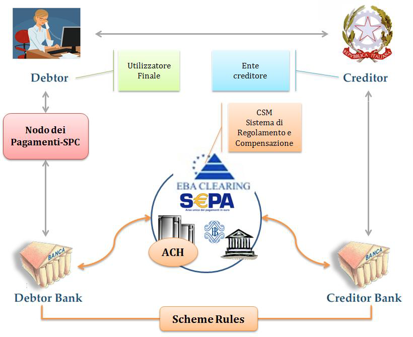

---
metaLinks:
  alternates:
    - >-
      https://app.gitbook.com/s/EnBg5c1okkV2J4KL0TcG/specifiche-attuative-del-nodo-dei-pagamenti-spc/funzionamento-generale/ruoli
---

# Roles

The operating model of the pagoPA Platform refers to the principles of the Four Corners model defined by the European Payment Council:

| End User **(Debtor)**                                   | Represents the private citizen, professional, or company that makes payments to the Public Administration, state-controlled companies, and Public Service Providers through electronic means. The identity of the end user can be determined by electronic means (typically SPID) to access the EC's IT services. Within the payment process, a distinction is made for the role of the debtor, i.e., the person who has incurred a debt to the EC, or makes a payment on their own initiative to obtain a service or certification. In the relationship with the EC, it can be assumed that the end user is the debtor. Finally, a distinction is made for the paying party, i.e., the person who accesses the IT services from the PSP and orders the payment to the EC. |
| -------------------------------------------------------------------------- | --------------------------------------------------------------------------------------------------------------------------------------------------------------------------------------------------------------------------------------------------------------------------------------------------------------------------------------------------------------------------------------------------------------------------------------------------------------------------------------------------------------------------------------------------------------------------------------------------------------------------------------------------------------------------------------------------------------------------------------------------------------------------------------------------------------------------------------------------------------------------------------------------------------------------------------------- |
| Creditor Entity **(Creditor)**                          | The entity from which the end user requests the service and to whom they are configured as a "creditor" for the various sums due. The EC, which identifies the payer and the reason for payment, offers the service through the Nodo dei Pagamenti-SPC, which it accesses directly or through a public or private entity acting as a technological intermediary for the EC.                                                                                                                                                                                                                                                                                                                                                                                                                                                                                                                                   |
| Payment Service Provider **(Debtor and Creditor Bank)** | It is the entity, authorised by the regulations in force, that executes payment requests electronically and returns the electronic receipt of payment/collection. The PSP offers its payment services by making available, directly or through third parties (intermediaries), the physical and electronic payment channels on which the end user can perform the transaction. In this context, based on specific agreements with the entity, the PSP can also perform "Collection" functions on its behalf and arrange for the subsequent transfer of the sums received to the treasury accounts that the EC holds with the PSP.                                                                                                                                                                                                                                          |

The completion of transactions ordered through the pagoPA platform occurs via the clearing and settlement system (CSM) using SEPA rules.

The pagoPA platform requires that activities related to making payments are carried out by ECs, either directly or through other entities (public and/or private).

In this regard, it is useful to distinguish between a technological intermediary and a technological partner:

- technological intermediary is an entity that, after joining the pagoPA platform, offers others a service for connecting to and exchanging flows with the pagoPA platform, in full compliance with the [Guidelines](https://www.gazzettaufficiale.it/eli/id/2018/07/03/18A04494/sg) and the related technical standards;
- technological partner is a business entity, which cannot join the pagoPA platform, that ECs use instrumentally for the execution of technical activities related to the provision of IT services, not necessarily specific to interfacing with the pagoPA platform, with the EC remaining liable to PagoPA S.p.A.

The pagoPA platform requires that activities related to making payments be carried out by PSPs either directly or through other entities, which PSPs use instrumentally for the execution of technical activities related to the provision of IT services, not necessarily specific to interfacing with the pagoPA platform, with the PSP remaining liable to PagoPA S.p.A.

## Role and responsibility of the PSP 

The PSP is the entity authorised by the regulations in force to execute payment requests electronically.

The PSP is required to execute the payment transaction requested by the end user according to the methods and timelines provided for by Legislative Decree. of 27 January 2010, no. 11 and related implementing provisions issued by the Bank of Italy.

The PSP is also legally responsible for:

- the quality, correctness, and completeness of the data it transmits;
- the correct updating of the data in its information system;
- security within its own domain;
- compliance with the provisions in [Quality indicators for adhering entities](../../appendici/indicatori-di-qualita-per-i-soggetti-aderenti/ "mention");

Regardless of the payer identification carried out by the EC, if applicable, also through its Technological Intermediary/Partner, the PSP remains responsible for identifying the Paying Party (holder of the debit bank account), as they are its client.

## Role and responsibility of the EC 

In the context of pagoPA, the EC category includes public administrations, state-controlled companies, as defined in the legislative decree adopted in implementation of Article 18 of Law no. 124 of 2015, excluding listed companies, and public service providers.

The EC is also legally responsible for:

- the quality, correctness, and completeness of the data it transmits, including the IBAN of the account to be credited;
- the correct updating of the data in its information system;
- security within its own domain;
- compliance with the provisions in [Quality indicators for adhering entities](../../appendici/indicatori-di-qualita-per-i-soggetti-aderenti/ "mention");

The EC is also responsible for the incorrect and/or omitted indication/publication of the data communicated to the end user for the execution of payments, including the failure to update the amount.

If the EC proceeds with identifying the payer, it will be responsible for the correctness and authenticity of the payer's identification data for the successful completion of the payment.

For the purpose of issuing the payment receipt, it will be the EC's responsibility to ensure that the data contained in the electronic receipt are consistent with those of the payment request.

## Role and responsibility of PagoPA S.p.A. 

The mission of PagoPA S.p.A. is the widespread diffusion of the digital payments and services system in the country, through the management of the pagoPA platform for digital payments to the Public Administration.

The pagoPA Platform, a product of PagoPA S.p.A., functionally plays a decisive role within the process of executing a payment to an EC:

- for the activation of mechanisms for the automatic alignment of the amount due;
- because it enables the payment of the debt position (and guarantees its settlement) without a direct relationship between the PSP and the EC;
- for the guarantee ensured to the provider Entity that the payment will be finalised.

These functionalities give the receipt issued by PagoPA S.p.A. and sent to the EC the discharging value of the payment for the citizen, representing for the EC the commitment by the PSP to credit the sums, authorising the provision of the service and also allowing the activation of digitised administrative processes.

PSPs and ECs authorise PagoPA S.p.A. and/or its assignees to monitor the provision of the services offered that are the subject of these implementing specifications, as well as to publish the data originating from this monitoring.

In consideration of any possible subsidiary service that PagoPA S.p.A. may perform, it may be qualified as a Technological Partner for each participating EC.

This qualification will correspond to an effective provision of subsidiary services if one or both of the following conditions are met:

- existence of a regulatory provision, primary and/or secondary, that identifies PagoPA S.p.A. as a Technological Partner;
- possession by the EC of any requirements for the operation of such subsidiary services.

The EC nevertheless retains the right to choose not to use the subsidiary services of PagoPA S.p.A. by using its own intermediary and/or Technological Partner for the same collection services.

## Role and responsibility of Technological Intermediaries and Partners 

The EC intermediary is an entity that allows the EC to access the Nodo Dei Pagamenti. Indeed, ECs can offer the service and access the Nodo dei Pagamenti-SPC not only in full autonomy, but also through a technological intermediary or a technological partner.

A technological Intermediary is an entity participating in the Nodo dei Pagamenti-SPC as an EC (e.g. a Region), which has therefore already accepted and undertaken to comply with the Guidelines and their annexes, and which is also responsible for the technical activities for interfacing with the Nodo dei Pagamenti-SPC.

Conversely, the technological Partner is a mere supplier to the EC, used instrumentally for the execution of technical activities for interfacing with the NodoSPC, with responsibility remaining with the EC. It should be noted that the Technological Partner as such is excluded from joining the Nodo dei Pagamenti-SPC.

PSPs, like ECs, can also use intermediaries to connect to the NodoSPC or to offer their payment services; such entities may be represented by other PSPs or by circuits or consortia established in the financial sector.

As with EC Intermediaries for ECs, PSP intermediaries are the entities that make their services available to the PSP.

## Compliance with payment workflows 

Each entity participating in the pagoPA system is required to scrupulously comply with the payment workflows described in this document.

Any interception of workflow customisations and/or adaptations, through the analysis of payment traffic or the use of monitoring tools, may lead to the exclusion of the entity from the payment platform.
