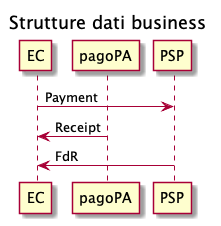
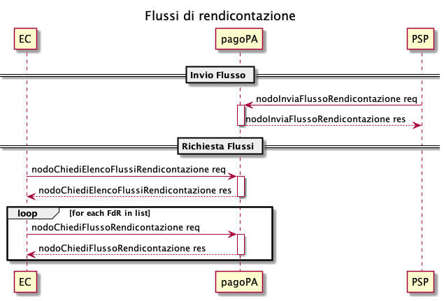
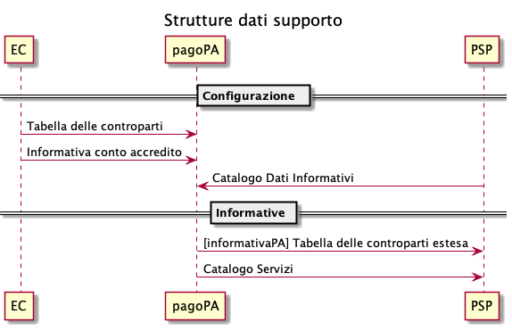

---
metaLinks:
  alternates:
    - >-
      https://app.gitbook.com/s/EnBg5c1okkV2J4KL0TcG/specifiche-attuative-del-nodo-dei-pagamenti-spc/modello-dati
---

# Data model

During the description of the interfaces, reference will be made to some entities whose relationships are shown by the following diagram

<figure><figcaption>
Debt Position Data Model
</figcaption></figure>

- _Debt Position_: represents the parent entity for which the Creditor Entity wants to receive payments through the platform. It is identified by the _IUPD_ (Unique Debt Position Identifier) and is composed as follows:
  - one or more _Payment Options_ (e.g. Single Solution, Installment Payment, etc.), more information in [Payment Options](../ente-creditore/opzioni-di-pagamento/);
  - each _Payment Option_ is composed of one or more _Installments (Rates),_ this entity contains all the information that identifies the payment notice (e.g. the _NAV_ and the _IUV_), 1 to 5 _Transfers_ are associated with each _Installment._
- _Payment Notice_: represents the notification (paper or digital) of each individual amount due to the citizen.
- _Payment_: describes in detail the payment transaction related to a notice and contains collection and credit information.
- _Receipt_: describes the outcome of a payment, contains the collection details and the credit forecast, and also contains the reference to the payment notice.
- _Reporting Flow_: details the transfer made to a Creditor Entity's current accounts by a PSP, it contains the list of all payments.

## Business data structures 

The _**payment**_ is an object generated by the Creditor Entity, managed by the pagoPA platform, and forwarded to the PSP; the Creditor Entity provides this object to the pagoPA platform with the response to the [paGetPayment](../appendix/Primitives/Creditor-Entity/api-soap.md#pagetpayment), the pagoPA platform provides this object to the PSP with the response to the [activatePaymentNotice](../appendix/Primitives/psp/soap-api.md#activatepaymentnotice-1); the _payment_ object provided to the PSP contains a subset of data sent by the Creditor Entity to the pagoPA platform.

The _**receipt**_ is an object generated by the pagoPA platform based on the data received from the response to the [paGetPayment](../appendix/Primitives/Creditor-Entity/api-soap.md#pagetpayment) (from the Creditor Entity) and the [sendPaymentOutcome](../appendix/Primitives/psp/soap-api.md#sendpaymentoutcome) (from the PSP); it is sent to the _n_ Creditor Entities involved in the payment via the [paSendRT](../appendix/Primitives/Creditor-Entity/api-soap.md#pasendrt) primitive; the _receipt_ object is forwarded to the Creditor Entity only if the payment has been made.

The _**reporting flow**_ contains the information that must be made available to the Creditor Entity to perform payment reconciliation operations. This flow must be made available to the interested parties by the PSP that carried out the payment transaction, no later than 24:00 on the second working day following receipt of the payment order (D+2). PSPs send each individual reporting flow to the pagoPA platform via the [nodoInviaFlussoRendicontazione](../appendix/Primitives/psp/soap-api.md#nodoinviaflussorendicontazione) primitive; for the receipt of reporting flows by Creditor Entities, the primitives to use are [nodoChiediElencoFlussiRendicontazione](../appendix/Primitives/Creditor-Entity/api-soap.md#nodochiedielencoflussirendicontazione), to get the list of available flows, and [nodoChiediFlussoRendicontazione](../appendix/Primitives/Creditor-Entity/api-soap.md#nodochiediflussorendicontazione) to download a specific flow.

## Support data structures 

The **Informative Data Catalogue** is the data structure through which, for the purpose of transaction transparency, the pagoPA-SPC Node registers for PSPs the data on payment conditions (maximum service costs, web pages with service descriptions, etc.). This catalogue is updated daily by the PSPs themselves.


The extended counterparties table has been deprecated, for more details refer to the [Deprecated Features](../appendix/Deprecated-Features.md) page


The **Services Catalogue** is used by PSPs to obtain the details of particular services offered by each Creditor Entity, in order to offer spontaneous payment ([spontaneous-payment-at-psp](../casi-duso/pagamento-spontaneo-presso-psp/ "mention")). This structure can be retrieved via the [nodoChiediCatalogoServizi](../appendix/Primitives/psp/soap-api.md#nodochiedicatalogoservizi) primitive.

.png>)
