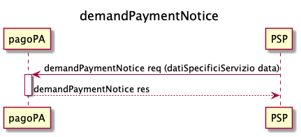
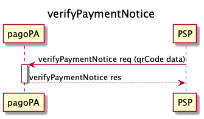
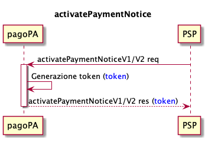
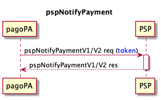
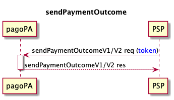

---
metaLinks:
  alternates:
    - >-
      https://app.gitbook.com/s/EnBg5c1okkV2J4KL0TcG/prestatore-di-servizi-di-pagamento/modalita-di-integrazione/integrazione-tramite-api
---

# API Integration


For error handling, refer to [Error Handling](https://app.gitbook.com/o/KXYtsf32WSKm6ga638R3/s/mU2qgiLV1G3m9z1VjAOc/ "mention")


## Debt Position Creation Request Phase

The [demandPaymentNotice](../../appendix/Primitives/psp/soap-api.md#demandpaymentnotice) can be used by PSPs to send the specific service data entered by the user, in order to receive in response the information necessary to start the payment process, in particular:

- the notice number;
- the tax code of the EC to be used in the activation phase;
- the partial amount of each individual payment;
- the tax code of the beneficiary EC for each individual payment.

This phase is mandatory for spontaneous payments activated at PSPs.

PSPs can retrieve specific service data via the [service-catalogue.md](../../casi-duso/pagamento-spontaneo-presso-psp/catalogo-dei-servizi.md "mention").

## Verification Phase

The [verifyPaymentNotice](../../appendix/Primitives/psp/soap-api.md#activatepaymentnotice) can be used by PSPs that initiate payment via the QR code on the paper notice or by manual data entry; with this request, the PSP requests the payment information related to a notice number, in particular:

- partial amount;
- tax code of the beneficiary EC.

The verification phase is optional for PSPs; if the Node finds that the position has already been closed, it responds with a KO for _PPT\_PAGAMENTO\_DUPLICATO_**.**

## Verification Phase by Poste Italiane

.png>)

The [verificaBollettino](../../appendix/Primitives/psp/soap-api.md#verificabollettino) can be used exclusively by the PSP Poste Italiane, which initiates the payment via the Data Matrix on the paper notice, and not via the QR Code. With this call, payment information related to a notice number is requested, in particular:

- partial amount;
- tax code of the beneficiary EC;
- the _allCCP_ parameter indicates to Poste Italiane whether the payment option can be associated with all postal current accounts or not
  - _allCCP = true_: the option can be associated with all postal current accounts;
  - _allCCP = false_: the option cannot be associated with all postal current accounts.

The verification phase is optional for PSPs; if the Node finds that the position has already been closed, it responds with a KO for _PPT\_PAGAMENTO\_DUPLICATO_**.**

## Activation Phase

With the [activatePaymentNotice](../../appendix/Primitives/psp/soap-api.md#activatepaymentnotice-1), the PSP asks the node to activate the payment with the EC.

Through this phase, the PSP is able to open a payment session, which blocks other payment attempts for the same notice. Through the same call, the PSP acquires the payment amount and the data necessary for the transfer of the sum, in particular for each transfer:

- partial amount;
- tax code of the beneficiary EC;
- IBAN to use for the transfer.

The activation phase is mandatory for PSPs.

The Node checks the status of the position:

- if another payment session is in progress, the Node responds with the faultCode _PPT\_PAGAMENTO\_IN\_CORSO_**;**
- if it has already been paid, the Node responds with the faultCode _PPT\_PAGAMENTO\_DUPLICATO_.

The PSP can initiate a retry process if it does not receive a response from the Node. In this regard, it should be noted that an [idempotency](best-practice.md#title-text-2) key can be used for this call.

## Payment Forwarding Phase

The details of payments made on PagoPA S.p.A. touchpoints are forwarded to the PSP via the [pspNotifyPayment](../../appendix/Primitives/psp/soap-api.md#pspnotifypayment).

In this phase, the necessary information is sent to be able to proceed with sending the payment outcome and any subsequent transfer, in particular:

- the _paymentTokens_ included in the payment transaction;
- the transaction identifiers provided by the PSP during the payment phase;
- for each transfer:
  - partial amount;
  - tax code of the beneficiary EC;
  - IBAN to use for the transfer.

If the PSP sends a KO in the response, the payment process terminates and a reversal must be performed. If the PSP were to send a [sendPaymentOutcome](../../appendix/Primitives/psp/soap-api.md#sendpaymentoutcome) with an OK _outcome_ anyway, this outcome would be rejected by the node.

If the PSP sends an OK in the response, it must send an OK _outcome_ in the [sendPaymentOutcome](../../appendix/Primitives/psp/soap-api.md#sendpaymentoutcome). If a KO were to be sent, the Node will respond with a faultBean:

- faultCode _PPT\_SEMANTICA_
- faultString _Semantic error_
- description _Mismatched outcome_

For a correct and standardized use of _metadata_, a dedicated [Metadata Dictionary](https://app.gitbook.com/o/KXYtsf32WSKm6ga638R3/s/u6YdY319vyFX9MIvnKBa/ "mention") has been created, in which there is a section dedicated to the payment channel information found in _additionalPaymentInformations_ of the [pspNotifyPayment vers. 2](../../appendix/Primitives/psp/soap-api.md#pspnotifypayment-versione-2).

## Sending Payment Outcome Phase

The PSP is required to provide the payment outcome **within 2 sec** with the [sendPaymentOutcome](../../appendix/Primitives/psp/soap-api.md#sendpaymentoutcome), both in case of a successful payment (outcome = OK) and a failed payment (outcome = KO). The effect of sending the payment outcome is to "unlock" the debt position on the platform:

- outcome = OK → debt position "closed";
- outcome = KO → debt position "reopened".

To facilitate the integration of different collection systems, the payment session has a limited duration ([Best Practice](best-practice.md)). When this time expires, the payment will be considered not to have occurred.

Note that it is the PSP's responsibility to do everything possible to notify the platform of the payment outcome before the _token_ expires. In particular, there are benefits for both the end user and the EC:

- in case of a negative outcome, the end user can immediately start a new payment session;
- in case of a positive outcome, the possibility of a duplicate payment is eliminated.

The PSP is therefore obliged, in case of non-delivery of the outcome, to initiate a [retry process](../../appendici/indicatori-di-qualita-per-i-soggetti-aderenti/#processi-di-retry). In this regard, it should be noted that an [idempotency](best-practice.md#title-text-2) key can be used for this call.

In case of formal or semantic errors, the Node will respond with the faultCodes _PPT\_SINTASSI\_EXTRAXSD_ and _PPT\_SEMANTICA_ respectively, indicating the reason for the error in the fault description. It is the PSP's responsibility to correct the error and initiate the retry process.

The Node might also respond with faultCode _PPT\_SEMANTICA_ in situations where, for technical reasons, the payment status is different from what is expected. In such cases, it is the PSP's responsibility to initiate the retry process.

Once the call is received, the Node checks if the token received in the _request_ exists. If it is not found, the Node will respond with the faultCode _PPT\_TOKEN\_SCONOSCIUTO_.

If an idempotency key is not used and an outcome for the payment already exists, the Node responds with the faultCode _PPT\_ESITO\_GIA\_ACQUISITO_ and the previously sent data is inserted in the faultBean's _description_ in JSON format.

If the position has already been paid, the Node returns the faultCode _PPT\_PAGAMENTO\_DUPLICATO. If, however, no activated payment position is found, the Node returns the faultCode _PPT\_PAGAMENTO\_SCONOSCIUTO_.

The Node checks the payment status to see whether the token is still valid. If it has expired, the Node will respond with the faultCode _PPT\_TOKEN\_SCADUTO_.

After sending the outcome for a payment, the PSP cannot modify it, whether the payment was successful (outcome = OK) or failed (outcome = KO).

Sending a [sendPaymentOutcome](../../appendix/Primitives/psp/soap-api.md#sendpaymentoutcome) with a positive outcome (outcome = OK) is a commitment by the PSP to transfer the payment amount to the EC, net of any exceptions with which the Node may respond.

At the end of the operation, the PSP, in line with current regulations, delivers a proof of payment which must contain (in addition to what is required by the regulations) the payment session identifier obtained during the payment operations (_paymentToken_).
