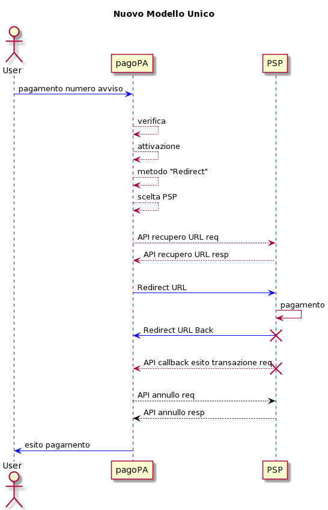
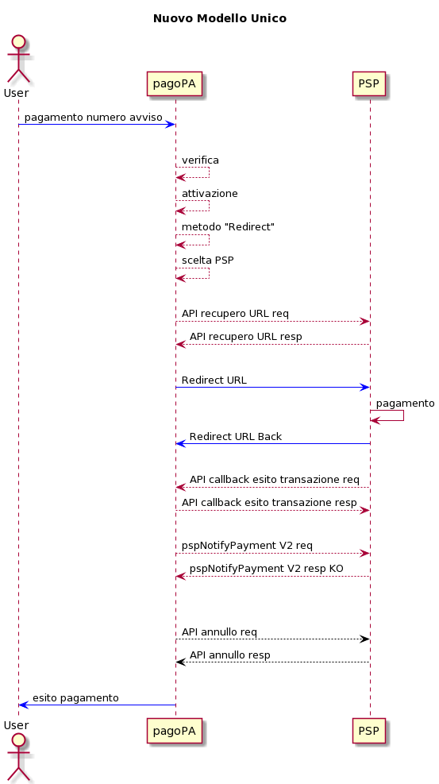

---
metaLinks:
  alternates:
    - >-
      https://app.gitbook.com/s/EnBg5c1okkV2J4KL0TcG/payment-service-provider/integration-methods/integration-for-payment-instrument-via-redirect
---

# Integration for payment instrument via Redirect

The _redirect_ payment method to solutions provided by individual PSPs or their affiliated third parties, introduced to facilitate payments on current accounts and similar for citizens and businesses, is designed according to the following guiding principles:

- _neutrality principle_: the pagoPA platform **must** make the same interfaces and technological integrations available to all PSPs without any customisation; all PSPs that currently have custom solutions are therefore asked to adapt to the new method, the only one available for the mandatory single payment model on the pagoPA platform;
- _PSD2 compliance_: as is the case today, it remains the responsibility of the PSP, which makes the payment instrument available (directly or through third parties), to ensure compliance with current regulations in terms of security, authentication (SCA) and banking best practices;
- _clear rules described in the SANP_: it is the choice of the company PagoPA S.p.A. to define which payment methods to allow within the _redirect_ mode, according to principles that must be clear and described in the SANP.

**Note:** Payment methods, even for payments on a current account (e.g., MyBank, BancomatPay, ...), that are natively integrated with the pagoPA payment gateway, cannot be integrated in _redirect_ mode.

A precondition for the PSP to enable all available payment instruments, including _redirect_, is integration with the Payments Hub according to the specifications of the single model and the population of the informational data catalogue via the pagoPA back office, which is accessible from the reserved area.

The PSP must make the following interfaces available to the pagoPA platform:

- [_URL retrieval API_](integration-for-payment-instrument-via-redirect.md#api-recupero-url): exposed on a public network by the PSP and invoked by the pagoPA platform to retrieve the URL that the user's browser will use to land in _redirect_ mode, conveying information about the payment to be made to the PSP in advance;
- [_Redirect_](integration-for-payment-instrument-via-redirect.md#redirect): a web page optimised for mobile devices on which the user lands in _redirect,_ which provides the payment authentication and authorisation functions. For any payment outcome or cancellation by the user, it must mandatorily trigger the outcome callback API and the _redirect_ to the pagoPA platform at the _urlback_ indicated in the [#api-recupero-url](integration-for-payment-instrument-via-redirect.md#api-recupero-url "mention") with the relative outcome;
- [_Transaction outcome callback API_](integration-for-payment-instrument-via-redirect.md#api-callback-esito-transazione): API exposed by pagoPA and invoked by the PSP for any payment outcome or user cancellation to allow the ongoing operation to be closed correctly, which, being a _redirect_ through the user's browser, by definition does not have guaranteed delivery;
- [_Cancellation API_](integration-for-payment-instrument-via-redirect.md#api-annullo): API exposed by the PSP and invoked by pagoPA to request cancellation of a payment whose outcome has never reached the platform, or for those residual cases where the payment is not finalised due to technical problems.

Connectivity follows the standard rules of the pagoPA platform, which can be consulted in [connettivita.md](../../appendici/connettivita.md "mention").


Fields marked with﹡are mandatory


## URL retrieval API

API invoked by the pagoPA platform to retrieve the URL on which to perform the redirect and to send information about the payment to the PSP in advance.

For technical specifications, refer to the [Retrieve redirect URL](../../appendici/primitive/psp/api-rest/#redirections)

## Redirect

The user, via a GET to the URL provided by the PSP in the response to the [#api-recupero-url](integration-for-payment-instrument-via-redirect.md#api-recupero-url "mention") call, is redirected by the pagoPA platform to the PSP's FE to perform payment authorisation.

For correct handling, the PSP must use the payment information sent by the pagoPA platform in the [#api-recupero-url](integration-for-payment-instrument-via-redirect.md#api-recupero-url "mention") call.

### **Outcome**

The payment workflow will involve the following steps based on the payment outcome:

- _redirect to a pagoPA page_: once the payment is complete, the user is redirected directly to pagoPA, at the address indicated in the _urlBack_ parameter of the [#api-recupero-url](integration-for-payment-instrument-via-redirect.md#api-recupero-url "mention")_;_
- _server-to-server notification_: a POST notification is sent to the [#api-callback-esito-transazione](integration-for-payment-instrument-via-redirect.md#api-callback-esito-transazione "mention") at the address communicated during the setup phase by PagoPA S.p.A.; to obtain confirmation that the notification has been received, the message returned by the call must be an _HTTP 200_, otherwise it must be resent with a retry logic ([#processi-di-retry](../../appendici/indicatori-di-qualita-per-i-soggetti-aderenti/#processi-di-retry "mention")).

## Transaction outcome callback API

As described in the previous paragraph, this is the server-to-server API that the PSP must mandatorily invoke in real time to notify pagoPA of the payment outcome.

The API is intended to provide a final outcome even if the _redirect_ from the PSP's FE to the pagoPA platform fails.

For technical specifications, refer to the [Callback API for communicate authorization outcome](../../appendici/primitive/psp/api-rest/#redirections-idtransaction-outcomes)

## Cancellation API

This API must be exposed by all PSPs to allow the pagoPA platform to cancel a payment in the event of a technical error.


It should be noted again that authorisation and settlement must be handled simultaneously in the same phase, as indicated in the workflow in [#integrazione-e-workflow-per-psp-strumento-di-pagamento-integrato-con-payment-gateway](offering-payment-systems-on-PagoPA-S.p.A.-touchpoints#integrazione-e-workflow-per-psp-strumento-di-pagamento-integrato-con-payment-gateway "mention")


The pagoPA platform invokes this API to request the cancellation of a payment in the following cases:

1. the outcome (positive or negative) never reached the pagoPA platform and, consequently, not the EC either;
2. due to technical problems, after the pagoPA platform received a positive outcome from the PSP, telematic communication between the pagoPA platform and the PSP was not possible or resulted in a discrepancy with the PSP and, as a result of this failed communication or discrepancy, the PSP did not acquire the necessary data for crediting the ECs involved in the transaction.

In the case of point 1, the cancellation makes the payment of the IUVs subject to the cancellation available again.

In the case of point 2, in addition to the above effect, the pagoPA platform cancels the positive outcome received from the PSP.

Each PSP must provide the URL to be invoked via the pagoPA back office for each environment (testing and production).

In the event of a non-response with an HTTP 200 outcome (which has the value of a positive outcome of the response to the call), it is pagoPA's responsibility to repeat the same call with a _retry_ logic.

The API has the characteristic of being _idempotent_, and the PSP must return the same outcome even if it has already processed the same request previously.

For technical specifications, refer to the [Api for refund](../../appendici/primitive/psp/api-rest/#redirections-refunds)

## Payment phase 

<figure><figcaption></figcaption></figure>

## Cancellation phase 

### Case 1 - Failure to receive payment outcome 

The pagoPA platform makes the cancellation call with a retry logic if it does not receive the payment outcome (positive or negative) within the _timeout_ indicated in the response to the [#api-recupero-url](integration-for-payment-instrument-via-redirect.md#api-recupero-url "mention") from the PSP or the default timeout of _10 minutes_ from the invocation of the redirect to the PSP's URL.

<figure><figcaption></figcaption></figure>

### Case 2 - pspNotifyPayment KO 

The pagoPA platform makes the cancellation call with a retry logic when the PSP has responded with KO to the [#pspnotifypayment](../../appendici/primitive/#pspnotifypayment "mention").

<figure><figcaption></figcaption></figure>
