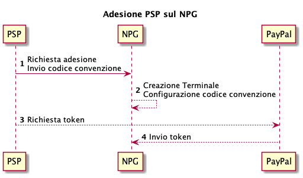
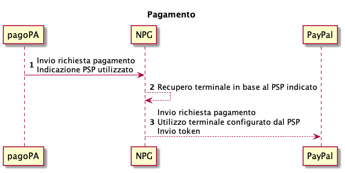
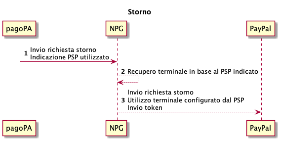

---
metaLinks:
  alternates:
    - >-
      https://app.gitbook.com/s/EnBg5c1okkV2J4KL0TcG/prestatore-di-servizi-di-pagamento/modalita-di-integrazione/integrazione-per-strumento-di-pagamento-paypal
---

# Integration for PayPal payment method

## Onboarding 

If an adhering PSP wants to connect to the PagoPA S.p.A. Payment Gateway (_NPG_) by enabling the PayPal® payment method, it is necessary to follow these steps:

1. send the onboarding request to the Payment Gateway containing the agreement code provided by PayPal®;
2. on the Payment Gateway, the terminal is configured by enabling the payment methods with the agreement code indicated by the adhering PSP;
3. to complete the enablement, the adhering PSP must access the PayPal domain via the Payment Gateway wizard with its business credentials to generate the corresponding token;
4. the generated token is configured on the terminal set up in step 2.

Please note that PagoPA S.p.A. does not sign agreements with PayPal®, so it is the responsibility of the adhering PSP to contact PayPal® if they want to offer this payment method on _NPG._

<figure><figcaption></figcaption></figure>

## Payment 

During the payment of a payment notice, the terminal of the adhering PSP selected by the citizen is used for communication between the Payment Gateway and PayPal®.

The token generated by the adhering PSP during the onboarding phase is also sent in the call to PayPal®.

<figure><figcaption></figcaption></figure>

## Reversal 

During a payment reversal, the same terminal for the PayPal® PSP selected during the payment phase is used.

The token generated by the PSP during the onboarding phase is sent in the call to the payment method.

<figure><figcaption></figcaption></figure>
