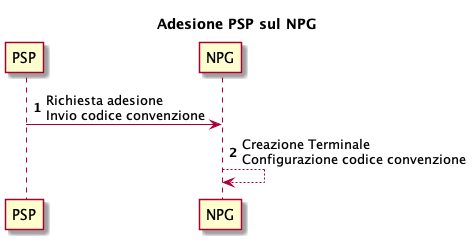
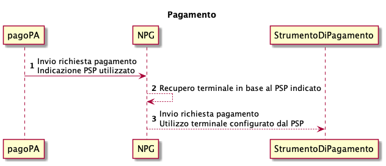
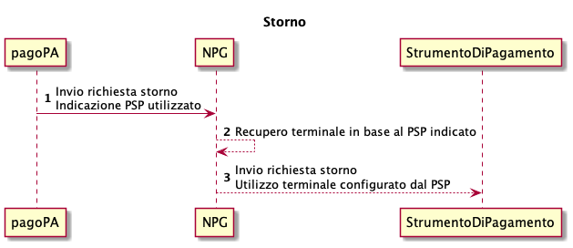

---
metaLinks:
  alternates:
    - >-
      https://app.gitbook.com/s/EnBg5c1okkV2J4KL0TcG/payment-service-provider/integration-methods/standard-integration-for-payment-instruments
---

# Standard integration for payment instruments

The content of this chapter is valid for the following payment instruments:

- ApplePay®
- BancomatPay®
- GooglePay®
- MyBank®

It should be noted that PagoPA S.p.A. does not sign agreements with

- ApplePay®
- BancomatPay®
- GooglePay®
- MyBank®

therefore, it is the responsibility of the participating PSP to contact them if they want to offer their payment instruments on _NPG._

## Onboarding 

If a participating PSP wants to activate on the PagoPA S.p.A. Payment Gateway (NPG), it is necessary to follow these steps:

1. Send an onboarding request to the Payment Gateway, indicating
   - the payment methods to be enabled;
   - the agreement codes for each payment method;
2. The Payment Gateway configures the terminal, enabling the payment methods with the agreement codes indicated by the participating PSP.

<figure><figcaption></figcaption></figure>

## Payment 

During the payment of a payment notice number, the terminal of the participating PSP selected by the citizen is used for communication between the Payment Gateway and the Payment Instrument.

Based on the agreement code indicated by the participating PSP, it is only possible to make enabled payments.

<figure><figcaption></figcaption></figure>

## Reversal 

During the reversal of a payment, the same terminal of the participating PSP selected during the payment phase is used.

<figure><figcaption></figcaption></figure>
