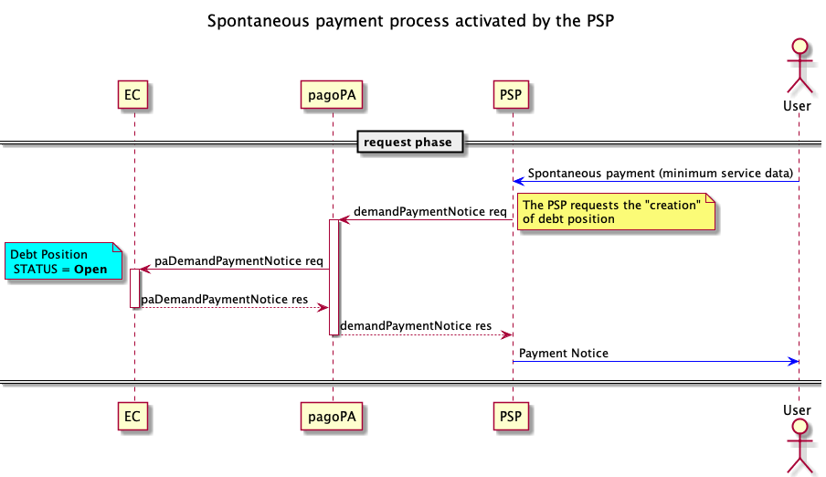

---
metaLinks:
  alternates:
    - >-
      https://app.gitbook.com/s/EnBg5c1okkV2J4KL0TcG/casi-duso/pagamento-spontaneo-presso-psp/bollo-auto
---

# Car tax

The car tax payment process is a use case of spontaneous payment activated by the PSP's touchpoint.

Typically, after entering their vehicle data, type and license plate, which will be sent to ACI for the creation of the debt position, the user can proceed with the payment.



- The [demandPaymentNotice](../../appendici/primitive/#demandpaymentnotice) can be used by PSPs to send the specific service data entered by the user, which in this case are essentially the license plate number and the vehicle type;
- the [paDemandPaymentNotice](../../appendici/primitive/#pademandpaymentnotice) is used to request that ACI create the debt position based on the license plate number and vehicle type. ACI will respond with the notice number and the data of the payment's Beneficiary Body; in fact, by verifying the vehicle owner's residence, it is able to determine the recipient Region for the payment;

Below is the structure that must be passed through the _datiSpecificiServizio_ tag in base64 format.

```xml
<tassaAuto>
    <veicoloConTarga>
        <tipoVeicoloTarga>1</tipoVeicoloTarga>
        <veicoloTarga>AB123CD</veicoloTarga>
    </veicoloConTarga>
</tassaAuto>
```
