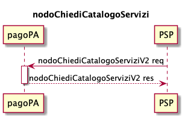

---
metaLinks:
  alternates:
    - >-
      https://app.gitbook.com/s/EnBg5c1okkV2J4KL0TcG/casi-duso/pagamento-spontaneo-presso-psp/catalogo-dei-servizi
---

# Service Catalog

The Service Catalog is the repository containing the list of generalized services activated by CEs, related to the payment process activated at PSPs in spontaneous mode.

The Service Catalog is updated and published daily.

The information in the Service Catalog is encoded in an XML file according to the format [https://github.com/pagopa/pagopa-api/blob/SANP3.3.0/xsd/CatalogoServizi\_2\_0\_0.xsd](https://github.com/pagopa/pagopa-api/blob/SANP3.3.0/xsd/CatalogoServizi_2_0_0.xsd) and must be sent by each CE to PagoPA S.p.A. through the functions provided on the dedicated Support Portal.



The information can be requested by individual PSPs from the pagoPA platform using the specific [nodoChiediCatalogoServizi](../../appendix/Primitives/psp/soap-api.md#nodochiedicatalogoservizi) primitive.

Each service in the Service Catalog is associated with a set of specific data necessary for the CE to provide the PSP with the _payment notice number_. This data set is associated with an XSD schema that defines its content and allows for information validation. The name of this XSD is reported in the _xsdRiferimento_ element of the Service Catalog.

Below is an example of the Service Catalog XML returned in the _xmlCatalogoServizi_ tag in base64 format via the [nodoChiediCatalogoServizi](../../appendix/Primitives/psp/soap-api.md#nodochiedicatalogoservizi) primitive.

```xml
<listaCatalogoServizi>
	<catalogoServizi>
		<idServizio>00009</idServizio>
		<descrizioneServizio>School meal payment</descrizioneServizio>
		<elencoSoggettiEroganti>
			<soggettoErogante>
				<idSoggettoServizio>00035</idSoggettoServizio>
				<idDominio>77777777777</idDominio>
				<denominazioneEnteCreditore>Nursery school meal payment</denominazioneEnteCreditore>
				<dataInizioValidita>2022-04-30</dataInizioValidita>
				<dataFineValidita>2024-04-30</dataFineValidita>
				<commissione>N</commissione>
			</soggettoErogante>
			<soggettoErogante>
				<idSoggettoServizio>00036</idSoggettoServizio>
				<idDominio>77777777777</idDominio>
				<denominazioneEnteCreditore>Kindergarten school meal payment</denominazioneEnteCreditore>
				<dataInizioValidita>2022-06-30</dataInizioValidita>
				<dataFineValidita>2024-06-30</dataFineValidita>
				<commissione>S</commissione>
			</soggettoErogante>
			<soggettoErogante>
				<idSoggettoServizio>00037</idSoggettoServizio>
				<idDominio>77777777778</idDominio>
				<denominazioneEnteCreditore>Kindergarten school meal payment</denominazioneEnteCreditore>
				<dataInizioValidita>2022-09-30</dataInizioValidita>
				<dataFineValidita>2024-09-30</dataFineValidita>
				<commissione>S</commissione>
			</soggettoErogante>
		</elencoSoggettiEroganti>
		<categoria>School Meals</categoria>
		<xsdRiferimento>mensa_scolastica_1_1_0.xsd</xsdRiferimento>
	</catalogoServizi>
</listaCatalogoServizi>
```

- _idServizio_: service identifier;
- _descrizioneServizio_: global description of the service;
- _elencoSoggettiEroganti_: list of CEs associated with the service;
- _categoria_: service category;
- _xsdRiferimento_: XSD schema that defines the content of the service-specific data and allows for information validation.

The _soggettoErogante_ object is defined as follows

- _idSoggettoServizio_: identifier of the association between the service and the CE;
- _idDominio_: identifier of the CE;
- _denominazioneEnteCreditore_: description attributed by the CE to the service;
- _dataInizioValidita_: service validity start date for the specific CE;
- _dataFineValidita_: service validity end date for the specific CE;
- _commissione_: flag that defines whether or not the CE wants to associate a commission fee with the service.
