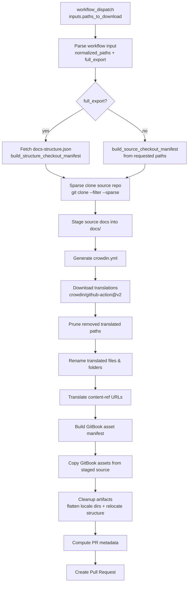
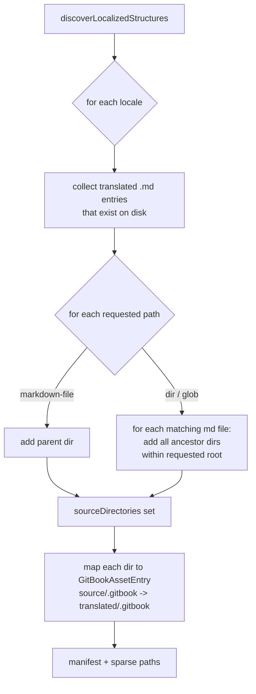
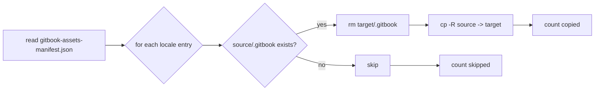
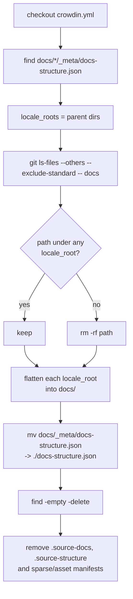
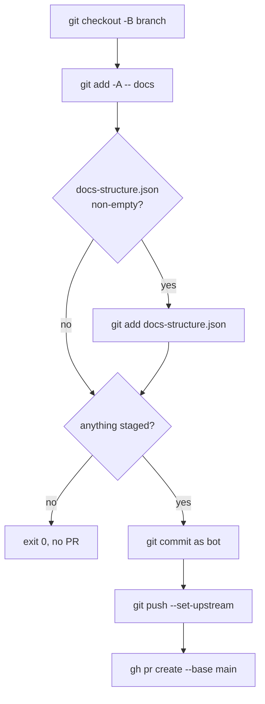

# Get Translations From Crowdin

## Overview

`Get Translations From Crowdin` is a manually triggered GitHub Actions workflow
([.github/workflows/get_translations_from_crowdin.yml](../../.github/workflows/get_translations_from_crowdin.yml))
that downloads approved translations from Crowdin and opens a pull request
containing the localized files already renamed and rewritten according to each
locale's `docs-structure.json`.

The workflow supports both full and differential exports. An optional
`paths_to_download` input accepts a list of paths (markdown files, directories,
or glob patterns); when omitted the entire `docs/` tree is downloaded. The
workflow:

1. Parses and normalizes the requested paths.
2. Sparsely clones only the matching source markdown and GitBook assets from the
   upstream source-docs repository (`SOURCE_DOCS_REPOSITORY`). For a full export
   the checkout is derived from the source repo's root `docs-structure.json`; for
   a specific-paths export it is derived from the requested paths.
3. Generates a Crowdin configuration scoped to those sources.
4. Downloads approved translations from Crowdin.
5. Prunes translated paths that no longer exist in the latest localized
   structure.
6. Renames downloaded files/folders to match the localized `docs-structure.json`
   of each locale.
7. Rewrites GitBook `content-ref` URLs inside translated markdown to point at
   the new translated paths.
8. Copies the matching `.gitbook` asset directories from the staged source into
   each locale.
9. Cleans up staging artifacts, flattens the translated locale folders into
   `docs/`, relocates `docs-structure.json` to the repository root, and opens a
   PR with only the localized changes.

### High-level pipeline



### Workflow inputs and environment

| Name | Source | Purpose |
| --- | --- | --- |
| `inputs.paths_to_download` | `workflow_dispatch` | Optional. Comma-separated / newline-separated / JSON array of partial docs paths or markdown files to process. When omitted, the whole `docs/` tree is downloaded (full export). |
| `SOURCE_DOCS_REPOSITORY` | job `env` | Upstream source-docs repository (`owner/name`). |
| `SOURCE_DOCS_BRANCH` | job `env` | Branch of the source repo to clone. |
| `SOURCE_DOCS_ROOT` | job `env` | Root directory inside the source repo holding the docs. |
| `SOURCE_DOCS_TOKEN` | secret | Optional PAT for cloning private source repos. The workflow's own `GITHUB_TOKEN` is **not** reused for this — it is repo-scoped. |
| `GIT_USER_NAME` | job `env` | Display name used for the translation commit (e.g. `github-actions[bot]`). |
| `GIT_USER_EMAIL` | job `env` | Email used for the translation commit (e.g. `github-actions[bot]@users.noreply.github.com`). |
| `CROWDIN_PROJECT_ID`, `CROWDIN_PERSONAL_TOKEN` | secrets | Used by `crowdin/github-action`. |

---

## Step-by-step walkthrough

Each step below is one workflow step (or tightly related pair of steps). For
each script-backed step, the section also describes the TypeScript entry point
under `src/` and shows its main behavior as a diagram.

### 1. Checkout, Node setup, dependency install

Standard setup: `actions/checkout`, the local composite action
`./.github/actions/setup-node`, npm cache via `actions/cache`, and `npm ci`.

### 2. Parse workflow input

- Step: `Parse workflow input`
- Script: [src/parseWorkflowInput.ts](../../src/parseWorkflowInput.ts) (npm
  script `parse_workflow_input`).
- Inputs: env `REQUESTED_PATHS_INPUT` (from `inputs.paths_to_download`).
- Outputs: step outputs `normalized_paths` (JSON array) and `full_export`
  (`true`/`false`).

The script accepts three shapes of input and normalizes them to a deduplicated
JSON array of non-empty trimmed strings. When the input is empty or omitted it
defaults to `["**"]` and sets `full_export=true`, which switches the workflow to
the full-export branch (download the entire `docs/` tree). Any explicit input
sets `full_export=false` (specific-paths export).

```mermaid
flowchart LR
    A[raw input string] --> B{empty?}
    B -- yes --> Z["default: [&quot;**&quot;]"]
    B -- no --> C{starts with `[`?}
    C -- yes --> D[JSON.parse as string array]
    C -- no --> E[split on newline or comma]
    D --> F[trim + dedupe + drop empties]
    E --> F
    F --> G[normalized_paths JSON]
    Z --> G
```

### 3. Build the source-checkout manifest (two mutually-exclusive branches)

The workflow computes the sparse-checkout paths differently depending on
`steps.parse-input.outputs.full_export`. Both branches produce the same step
outputs — `has_sources`, `manifest_path`, `sparse_checkout_file` — which the
later fetch and PR-metadata steps select with a `||` fallback.

#### 3a. Full export (`full_export == 'true'`)

Two steps run only when `full_export == 'true'`:

- `Fetch docs-structure.json for full export`: shallow sparse-clones just the
  source repo's **root** `docs-structure.json` into `.source-structure/`
  (env `SOURCE_STRUCTURE_CHECKOUT_PATH`), failing if it is missing.
- `Build source checkout manifest from docs-structure.json`
  (id `structure-checkout`):
  [src/buildStructureCheckoutManifest.ts](../../src/buildStructureCheckoutManifest.ts)
  (npm script `build_structure_checkout_manifest`). Reads
  `SOURCE_STRUCTURE_PATH=.source-structure/docs-structure.json` and derives the
  checkout from the docs actually synced to Crowdin, so a full export fetches
  exactly those docs rather than the whole repo.

#### 3b. Specific-paths export (`full_export != 'true'`)

- Step: `Build source checkout manifest from requested paths`
  (id `source-checkout`)
- Script: [src/buildSourceCheckoutManifest.ts](../../src/buildSourceCheckoutManifest.ts)
  (npm script `build_source_checkout_manifest`).
- Inputs: env `REQUESTED_PATHS` (the normalized JSON array), env
  `SOURCE_DOCS_ROOT`.
- Outputs: `has_sources`, `manifest_path` (JSON manifest with `requestedPaths`,
  `sourceDocsRoot`, `sparseCheckoutPaths`), `sparse_checkout_file` (newline list
  consumed by `git sparse-checkout set --no-cone --stdin`).

For every requested path the script expands two kinds of sparse-checkout
patterns: the markdown content path and the `.gitbook` asset paths that GitBook
expects next to it.

```mermaid
flowchart TD
    A[requestedPaths] --> B[normalizeRequestedDocsPath]
    B --> C{kind?}
    C -- markdown-file --> D[source/&lt;file&gt;.md<br/>+ siblings/.gitbook]
    C -- partial-root --> E[source/&lt;dir&gt;/**<br/>+ static dir/.gitbook<br/>+ static dir/**/.gitbook]
    C -- glob-pattern --> F[same as partial-root<br/>(unless trailing `**`)]
    D --> G[dedupe + sort]
    E --> G
    F --> G
    G --> H[sparseCheckoutPaths]
    H --> I[write manifest JSON]
    H --> J[write sparse checkout file]
```

### 4. Sparse clone and stage source docs

Two shell steps, guarded by
`steps.structure-checkout.outputs.has_sources == 'true' || steps.source-checkout.outputs.has_sources == 'true'`
(whichever manifest branch from step 3 ran):

- `Fetch requested source docs and assets`: clones
  `SOURCE_DOCS_REPOSITORY@SOURCE_DOCS_BRANCH` with
  `--depth 1 --filter=blob:none --sparse`, then applies
  `git sparse-checkout set --no-cone --stdin < $SPARSE_CHECKOUT_FILE`. Uses an
  anonymous URL by default, or `https://x-access-token:$SOURCE_DOCS_TOKEN@…`
  when the secret is set. The workflow's own `GITHUB_TOKEN` is deliberately not
  reused (it is repo-scoped to the target repo).
- `Stage requested source docs and assets`: copies
  `.source-docs/$SOURCE_DOCS_ROOT/.` into `docs/` with `cp -Rn` so existing
  committed files are not overwritten. This makes the requested source
  markdown available to `generate_crowdin_config` for matching.

A `Log staged docs tree` step then always prints the resulting `docs/` tree
(`find docs | sort`); there is no separate `debug` input gating it.

### 5. Generate `crowdin.yml`

- Step: `Generate crowdin.yml to get only requested paths`
- Script: [src/generateCrowdinConfig.ts](../../src/generateCrowdinConfig.ts)
  (npm script `generate_crowdin_config`).
- Inputs: env `REQUESTED_PATHS`, the staged `docs/` tree.
- Output: `crowdin.yml` at repo root (kept docs-rooted: `base_path: .`,
  `preserve_hierarchy: true`).

The script always emits one entry for `docs-structure.json` plus one entry per
matching source markdown file (deduplicated). It fails if a requested path does
not match any source markdown under `docs/`.

```mermaid
flowchart TD
    A[REQUESTED_PATHS] --> B[normalize requested paths]
    C[walk docs/ for .md files<br/>(skip .gitbook)] --> D[sourceMarkdownPaths]
    B --> E[assert each requested path<br/>matches at least one source .md]
    D --> E
    E --> F[structure entry<br/>docs-structure.json -&gt; docs/%locale%/_meta/...]
    B --> G[content entries<br/>per matched source .md]
    D --> G
    F --> H[crowdin.yml]
    G --> H
```

### 6. Download translations from Crowdin

The `crowdin/github-action` step runs in download-only mode
(`download_translations: true` with
`download_translations_args: --skip-untranslated-files`, all upload/push options
off, `export_only_approved: true`, `create_pull_request: false`,
`base_url: https://pagopa.crowdin.com`). Crowdin writes translated files into
`docs/<locale>/...` using the source-relative paths from `crowdin.yml`.

A subsequent `Fix permissions on downloaded files` step `chown`s `docs/` back
to the workflow user.

### 7. Prune removed translated paths

- Step: `Remove stale files and folders from repository`
- Script: [src/pruneRemovedTranslatedPaths.ts](../../src/pruneRemovedTranslatedPaths.ts)
  (npm script `prune_removed_translated_paths`).

For each locale (discovered via `docs/<locale>/_meta/docs-structure.json`), the
script loads the **previously committed** version of the same structure from
`HEAD` and compares it with the freshly downloaded structure. Entries that
exist in the old structure but not the new one are deleted from
`docs/<locale>/...`.

```mermaid
flowchart TD
    A[discover docs/*/_meta/docs-structure.json] --> B{for each locale}
    B --> C[git show HEAD:&lt;structure path&gt;]
    C -- missing --> D[skip locale]
    C -- found --> E[collectPrunableStructureEntries<br/>(old vs current)]
    E --> F[sort dirs shallow-first,<br/>files deep-first]
    F --> G[rm directories<br/>track removed roots]
    F --> H[rm files<br/>skip if ancestor removed]
    G --> I[remove now-empty parents<br/>up to locale root]
    H --> I
```

The script refuses to delete anything outside the locale root.

### 8. Rename translated files and folders

- Step: `Rename translated files and folders`
- Script: [src/renameTranslatedFilesAndFolders.ts](../../src/renameTranslatedFilesAndFolders.ts)
  (npm script `rename_translated_files_and_folders`).

Crowdin downloads files using the **source** path; the localized
`docs-structure.json` carries the translated labels. This script renames
folders and files in place so that each locale's tree on disk matches its
structure file.

Critical ordering (see repo memory): rename directories deepest-first, only
changing the **leaf segment** under the still-source parent; then rename files
from inside their already-translated parent directories.

```mermaid
flowchart TD
    A[collectTranslatedStructureEntries] --> B[assertUniqueTargets per locale]
    B --> C[directory operations<br/>(source != target)]
    B --> D[file operations<br/>(source != target)]
    C --> E[sort by depth DESC]
    D --> F[sort by depth DESC]
    E --> G[rename leaf segment only<br/>under current source parent]
    G --> H[file paths now resolve under<br/>translated parent directories]
    F --> H
    H --> I[rename files to translated name]
```

If a target already exists or there is a target-name collision the script
fails fast.

### 9. Translate markdown links

- Step: `Translate links in translated files`
- Script: [src/translateLinks.ts](../../src/translateLinks.ts)
  (npm script `translate_links`).

GitBook embeds cross-document references both as `content-ref` blocks and as
plain markdown links:

```text

[link text](some/path.md)


See the [related guide](some/path.md) for more details.
```

After renaming, those URLs still point at the original source-named paths.
This script rewrites them per locale so they point at the translated
counterpart. Both `content-ref` URLs and standard `[text](url)` links are
translated. External URLs (e.g. `https://`), pure anchors (`#...`), image
embeds (``) and links that do not point to a localized markdown file are
left untouched.

```mermaid
flowchart TD
    A[for each locale] --> B[markdown entries from structure]
    B --> C[build sourcePath -&gt; targetRelativePath map]
    C --> D[for each translated .md on disk]
    D --> E[regex match content-ref blocks<br/>and markdown links]
    E --> F{translatable target?<br/>(local .md, not external/anchor/image)}
    F -- no --> L[leave match unchanged]
    F -- yes --> G[resolve raw URL to source path<br/>(absolute or relative to current file)]
    G --> H{found in map &&<br/>translated file exists?}
    H -- no --> I[warn, leave match unchanged]
    H -- yes --> J[compute relative translated URL]
    J --> K[rewrite content-ref url= and/or<br/>markdown link target]
    K --> M[write file if anything changed]
```

Query strings and fragments (`?...`, `#...`) on the URL are preserved.

### 10. Build GitBook asset manifest

- Step: `Build GitBook asset manifest`
- Script: [src/buildGitBookAssetManifest.ts](../../src/buildGitBookAssetManifest.ts)
  (npm script `build_gitbook_asset_manifest`).
- Output: `gitbook-assets-manifest.json` (per-locale entries pairing source
  `.gitbook` paths with their translated destinations) and
  `.gitbook-asset-sparse-checkout.txt`. Sets `has_assets`.

The script inspects each locale's structure and the markdown files actually
present on disk (i.e., that were downloaded for this run), then picks the
`.gitbook` directories that need to be copied. For markdown-file requests this
is just the parent directory's `.gitbook`. For directory/glob requests it
includes every ancestor directory inside the requested root that contains a
translated markdown file.



### 11. Copy GitBook assets

- Step: `Copy GitBook assets` (guarded by `has_assets == 'true'`)
- Script: [src/copyGitBookAssets.ts](../../src/copyGitBookAssets.ts) (npm
  script `copy_gitbook_assets`).
- Inputs: env `SOURCE_DOCS_REPO_PATH=.` (the staged source docs from step 4 are
  already in the repo root under `docs/`), and the manifest from step 10.

For each manifest entry it copies `sourceGitBookPath` into
`translatedGitBookPath` (clearing the target first). Missing source `.gitbook`
directories are silently skipped.



### 12. Cleanup artifacts

- Step: `Cleanup artifacts`

A shell step that removes everything that should not appear in the PR and
reshapes the tree into the translation-repo layout:

- `git checkout -- crowdin.yml` to discard the generated config.
- Removes any **untracked** files under `docs/` that are not under a locale
  root (i.e., the staged source markdown that did not get a translation). A
  locale root is detected by the presence of
  `docs/<locale>/_meta/docs-structure.json`.
- **Flattens each translated locale folder** (e.g. `docs/en-US/`) into `docs/`
  with `cp -Rf` and removes the locale folder, so on `main` translations live
  directly under `docs/` with no leading locale directory. Existing files are
  overwritten; other content already under `docs/` is preserved.
- **Relocates the localized structure file**: if `docs/_meta/docs-structure.json`
  exists (after flattening), `mv -f` moves it to the repository root as
  `docs-structure.json`, overwriting the transient placeholder
  `generate_crowdin_config` wrote, so it can be diffed against the next run.
- Deletes empty directories left behind (including `docs/_meta/` once the
  structure file is relocated).
- Removes the staging artifacts at the repo root: `.source-docs`,
  `.source-structure`, `.source-docs-sparse-checkout.txt`,
  `gitbook-assets-manifest.json`, `.gitbook-asset-sparse-checkout.txt`. The
  source-checkout manifest JSON is intentionally **left** for the
  `Compute PR metadata` step, which reads and removes it itself.



### 13. Compute PR metadata

- Step: `Compute PR metadata`

Builds a deterministic branch name and PR title from the UTC timestamp and an
8-char SHA-1 hash of the original `inputs.paths_to_download` string:

```txt
branch  = l10n_crowdin_translations-<YYYYMMDD-HHMMSS>-<input_hash>
title   = New Crowdin Translations (<YYYYMMDD-HHMMSS>-<input_hash>)
```

The PR body lists the `requestedPaths` field from whichever step-3 manifest ran
(`steps.structure-checkout.outputs.manifest_path || steps.source-checkout.outputs.manifest_path`,
read with an inline Node snippet), then deletes the manifest file.

### 14. Create Pull Request

- Step: `Create Pull Request with translations`

Stages `docs/` plus the relocated root `docs-structure.json` (added only when it
is non-empty, via a `[ -s docs-structure.json ]` guard, so the empty placeholder
is never committed), exits cleanly if there are no staged changes, otherwise
commits as `chore: update Crowdin translations` using the identity configured in
`GIT_USER_NAME` / `GIT_USER_EMAIL`, pushes the branch, and runs
`gh pr create --base main --head $BRANCH_NAME`.



---

## Script reference

| Script | npm command | Step in workflow |
| --- | --- | --- |
| [src/parseWorkflowInput.ts](../../src/parseWorkflowInput.ts) | `parse_workflow_input` | Parse workflow input |
| [src/buildSourceCheckoutManifest.ts](../../src/buildSourceCheckoutManifest.ts) | `build_source_checkout_manifest` | Build source checkout manifest from requested paths (specific-paths export) |
| [src/buildStructureCheckoutManifest.ts](../../src/buildStructureCheckoutManifest.ts) | `build_structure_checkout_manifest` | Build source checkout manifest from `docs-structure.json` (full export) |
| [src/generateCrowdinConfig.ts](../../src/generateCrowdinConfig.ts) | `generate_crowdin_config` | Generate `crowdin.yml` |
| [src/pruneRemovedTranslatedPaths.ts](../../src/pruneRemovedTranslatedPaths.ts) | `prune_removed_translated_paths` | Remove stale files |
| [src/renameTranslatedFilesAndFolders.ts](../../src/renameTranslatedFilesAndFolders.ts) | `rename_translated_files_and_folders` | Rename translated files and folders |
| [src/translateLinks.ts](../../src/translateLinks.ts) | `translate_links` | Translate links in translated files |
| [src/buildGitBookAssetManifest.ts](../../src/buildGitBookAssetManifest.ts) | `build_gitbook_asset_manifest` | Build GitBook asset manifest |
| [src/copyGitBookAssets.ts](../../src/copyGitBookAssets.ts) | `copy_gitbook_assets` | Copy GitBook assets |

Shared structure parsing and path normalization used by all scripts lives in
[src/translationStructure.ts](../../src/translationStructure.ts).
